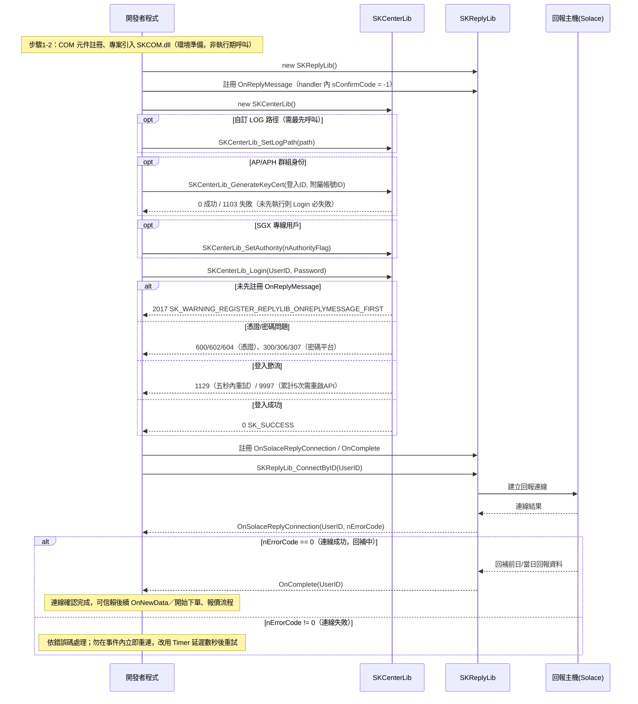

# 流程A：初始化與登入

## 目標（一句話）

完成 SKCOM.dll 的 COM 環境設置、建立 `SKCenterLib` / `SKReplyLib` 物件並正確排序事件註冊，通過雙因子登入（`SKCenterLib_Login`）並建立回報連線（`SKReplyLib_ConnectByID`），直到收到 `OnComplete` 才算「連線確認」完成，可交給後續下單／報價流程使用。

## 前置條件

- COM 元件已依環境需求註冊：[modules/SKCenterLib.md](../modules/SKCenterLib.md) 節「陷阱與注意」（COM 註冊位元須與程式建置位元一致）；細節見 `api_spec/_raw/1.環境設置.md`。
- 已申請 API 權限、完成雙因子憑證安裝／綁定：[modules/SKCenterLib.md](../modules/SKCenterLib.md) 節「初始化與事件註冊」；細節見 `api_spec/_raw/3.登入.md`（登入前置準備）。
- 已理解「登入前必須先註冊 `SKReplyLib.OnReplyMessage`」此硬性順序：[modules/SKReplyLib.md](../modules/SKReplyLib.md) 節「陷阱與注意」第 1 點。
- 若為 AP／APH 群組（無憑證）身份，需先備妥附屬帳號 ID：[modules/SKCenterLib.md](../modules/SKCenterLib.md) 節「方法」之 `SKCenterLib_GenerateKeyCert`。

## 步驟總表

| # | 呼叫 | 所屬 lib | 說明 | 規格出處（modules/xx.md#節名） |
|---|---|---|---|---|
| 1 | `regsvr32` 或元件資料夾 `install.bat`（系統管理員身分，位元需對應 x64/x86） | — 環境 | 註冊 SKCOM.dll 及同資料夾之憑證/報價元件 | `api_spec/_raw/1.環境設置.md`；modules/SKCenterLib.md 節「陷阱與注意」 |
| 2 | Visual Studio「Add Reference」引入 SKCOM.dll，程式頂端 `using SKCOMLib;` | — 專案設定 | 讓 C# 專案可見 Interop 型別（`SKCenterLib`、`SKReplyLib`…） | `api_spec/_raw/1.環境設置.md` |
| 3 | `new SKReplyLib()` | SKReplyLib | 建立回報物件。**必須先建立**，才能在登入前掛 `OnReplyMessage` | [modules/SKReplyLib.md](../modules/SKReplyLib.md#skreplylib-回報委託成交回報事件中樞登入前必須註冊) 節「初始化與事件註冊」 |
| 4 | 註冊 `m_pSKReply.OnReplyMessage`（handler 內 `out short nConfirmCode` 必須設為 `-1`） | SKReplyLib | **登入前置硬性要求**：未註冊會導致 `SKCenterLib_Login` 回傳 2017 | [modules/SKReplyLib.md](../modules/SKReplyLib.md)#onreplymessage；modules/SKCenterLib.md 節「方法」之 `SKCenterLib_Login`備註 |
| 5 | `new SKCenterLib()` | SKCenterLib | 建立登入＆環境設定物件 | [modules/SKCenterLib.md](../modules/SKCenterLib.md) 節「初始化與事件註冊」 |
| 6（可選） | `SKCenterLib_SetLogPath(bstrPath)` | SKCenterLib | 若需自訂 LOG 路徑，**必須最先呼叫**，先於一切函式（含 Login） | [modules/SKCenterLib.md](../modules/SKCenterLib.md#skcenterlib_setlogpath) |
| 7（可選，AP/APH 群組身份） | `SKCenterLib_GenerateKeyCert(bstrLogInID, bstrCustCertID)` | SKCenterLib | 以附屬帳號已安裝之憑證產生雙因子登入 key，須在 Login 前執行成功；非群組身份呼叫會得 2028 | [modules/SKCenterLib.md](../modules/SKCenterLib.md#skcenterlib_generatekeycert) |
| 8（可選，SGX 專線用戶） | `SKCenterLib_SetAuthority(nAuthorityFlag)` | SKCenterLib | 開啟 SGX API DMA 專線 / 切換測試環境；一般客戶忽略 | [modules/SKCenterLib.md](../modules/SKCenterLib.md#skcenterlib_setauthority) |
| 9 | `SKCenterLib_Login(bstrUserID, bstrPassword)`（或 `SKCenterLib_LoginSetQuote(..., "N")` 停用報價） | SKCenterLib | 雙因子（憑證綁定）登入；帳號需大寫；回傳 0 才算成功 | [modules/SKCenterLib.md](../modules/SKCenterLib.md#skcenterlib_login)；[modules/SKCenterLib.md](../modules/SKCenterLib.md#skcenterlib_loginsetquote) |
| 10 | 登入成功後，依需要註冊 `SKReplyLib` 其餘連線事件：`OnSolaceReplyConnection`、`OnSolaceReplyDisconnect`、`OnComplete`（另有 `OnReplyClear`、`OnNewData`、`OnStrategyData` 供後續回報流程使用） | SKReplyLib | 建立連線前註冊一次即可，供步驟 11 觀察結果 | [modules/SKReplyLib.md](../modules/SKReplyLib.md) 節「初始化與事件註冊：C# 實際寫法」 |
| 11 | `SKReplyLib_ConnectByID(bstrUserID)` | SKReplyLib | 指定登入帳號建立回報主機（Solace）連線，觸發回補 | [modules/SKReplyLib.md](../modules/SKReplyLib.md#skreplylib_connectbyid) |
| 12 | 等待事件 `OnSolaceReplyConnection`（`nErrorCode==0`） | SKReplyLib | 僅代表「連上」，**尚未**代表回補完成，勿在此事件內立即重連/斷線 | [modules/SKReplyLib.md](../modules/SKReplyLib.md#onsolacereplyconnection) |
| 13 | 等待事件 `OnComplete` | SKReplyLib | **連線確認完成**的判定點；未收到視為連線/資料異常 | [modules/SKReplyLib.md](../modules/SKReplyLib.md#oncomplete) |

## 最小可運作 C# 骨架

以下從官方範例 `SKCOMTesterV2`／`SKCOMTester` 拼接精簡而成；每段標註來源（相對路徑:行號）。省略與登入流程無關的 UI 控制項細節（如 dataGridView 清空、下單物件初始化）。

```csharp
using SKCOMLib;

namespace LoginDemo
{
    public partial class MainForm : Form
    {
        // 全域物件：登入&環境設定物件、回報物件
        SKCenterLib m_pSKCenter = new SKCenterLib();
        SKReplyLib  m_pSKReply  = new SKReplyLib();
        // 來源：SKCOMTesterV2/WindowsFormsApp1/MainForm.cs:19-20

        private void MainForm_Load(object sender, EventArgs e)
        {
            // 步驟4：登入前必須註冊公告，handler 內回傳 -1，否則 Login 會得到 2017
            m_pSKReply.OnReplyMessage +=
                new _ISKReplyLibEvents_OnReplyMessageEventHandler(OnAnnouncement);
            void OnAnnouncement(string strUserID, string bstrMessage, out short nConfirmCode)
            {
                nConfirmCode = -1; // 必須回傳 -1，未回傳將無法正確登入
                richTextBoxMessage.AppendText(
                    $"【註冊公告OnReplyMessage】{strUserID}_{bstrMessage}\n");
            }
            // 來源：SKCOMTesterV2/WindowsFormsApp1/MainForm.cs:190-199

            // （可選）其餘 SKCenterLib 事件，登入前掛好即可
            m_pSKCenter.OnShowAgreement +=
                new _ISKCenterLibEvents_OnShowAgreementEventHandler(OnShowAgreement);
            void OnShowAgreement(string bstrData) =>
                richTextBoxMessage.AppendText($"【OnShowAgreement】{bstrData}\n");
            // 來源：SKCOMTesterV2/WindowsFormsApp1/MainForm.cs:202-210
        }

        private void buttonSKCenterLib_Login_Click(object sender, EventArgs e)
        {
            // 帳號需大寫，官方範例一律 .ToUpper()（否則可能得到 1000 SK_ERROR_LOGIN_FIRST）
            string UserID = textBoxUserID.Text.Trim().ToUpper();
            string Password = textBoxPassword.Text;
            // 來源：SKCOMTester/Form1.cs:109（帳號大寫用法）

            // 步驟7（可選，僅 AP/APH 群組身份）：須成功後才可 Login，否則得到 1103
            // int nKeyCode = m_pSKCenter.SKCenterLib_GenerateKeyCert(UserID, bstrCustCertID);
            // 來源：SKCOMTesterV2/WindowsFormsApp1/MainForm.cs:413

            // 步驟9：雙因子登入
            int nCode = m_pSKCenter.SKCenterLib_Login(UserID, Password);
            string msg = "【SKCenterLib_Login】" + m_pSKCenter.SKCenterLib_GetReturnCodeMessage(nCode);
            richTextBoxMethodMessage.AppendText(msg + "\n");
            // 來源：SKCOMTesterV2/WindowsFormsApp1/MainForm.cs:875-883

            if (nCode == 0) // 登入成功，才可建立回報連線
            {
                ConnectReply(UserID);
            }
            // 失敗（101/300/306/307/600/602/604/1103/1129/9997…）處理見下方「常見錯誤與檢查點」
        }

        private void ConnectReply(string userID)
        {
            // 步驟10：連線前註冊一次即可；此處僅列與「連線確認」直接相關的兩個事件
            m_pSKReply.OnSolaceReplyConnection +=
                new _ISKReplyLibEvents_OnSolaceReplyConnectionEventHandler(OnSolaceReplyConnection);
            m_pSKReply.OnComplete +=
                new _ISKReplyLibEvents_OnCompleteEventHandler(OnComplete);
            // 來源：SKCOMTesterV2/WindowsFormsApp1/ReplyForm.cs:1639,1566（事件註冊處，精簡）

            // 步驟11：指定回報連線的使用者登入帳號
            int nCode = m_pSKReply.SKReplyLib_ConnectByID(userID);
            richTextBoxMethodMessage.AppendText(
                "【SKReplyLib_ConnectByID】" + m_pSKCenter.SKCenterLib_GetReturnCodeMessage(nCode) + "\n");
            // 來源：SKCOMTesterV2/WindowsFormsApp1/ReplyForm.cs:1923
        }

        // 步驟12：nErrorCode==0 僅代表「連上」，尚未回補完成；勿在此事件內立即重連/斷線
        private void OnSolaceReplyConnection(string bstrUserID, int nErrorCode)
        {
            string msg = nErrorCode == 0 ? "連線成功" : "連線失敗";
            richTextBoxMessage.AppendText($"【OnSolaceReplyConnection】{bstrUserID}_{msg}\n");
        }
        // 來源：SKCOMTesterV2/WindowsFormsApp1/ReplyForm.cs:1639-1651

        // 步驟13：回補完成才代表「連線確認」完成，之後才可信賴 OnNewData / 進行下單
        private void OnComplete(string bstrUserID)
        {
            richTextBoxMessage.AppendText($"【OnComplete】{bstrUserID}回報連線&資料正常\n");
        }
        // 來源：SKCOMTesterV2/WindowsFormsApp1/ReplyForm.cs:1566-1575
    }
}
```

## Mermaid sequenceDiagram



## 常見錯誤與檢查點

錯誤碼定義與完整對照表見 [../error_codes.md](../error_codes.md)（`api_spec/_raw/3.登入.md:314-366` 為原始出處）。以下為此流程最常踩到的檢查點：

1. **2017 SK_WARNING_REGISTER_REPLYLIB_ONREPLYMESSAGE_FIRST**：`SKCenterLib_Login` 前未建立 `SKReplyLib` 並註冊 `OnReplyMessage`。檢查點：步驟 3-4 必須在步驟 9 之前完成，且 handler 內確實回傳 `sConfirmCode = -1`。
2. **1000 SK_ERROR_LOGIN_FIRST**：常見原因是登入帳號非大寫（官方範例一律 `.ToUpper()`），或尚未成功登入就呼叫其他函式。
3. **1103 SK_ERROR_AP_APH_GENERATEKEY_INVALID_BEFORE_LOGIN**：AP/APH 群組身份未先執行 `SKCenterLib_GenerateKeyCert` 或執行失敗即呼叫 `Login`。非群組身份誤呼叫 `GenerateKeyCert` 則得 2028（應忽略此步驟）。
4. **1129 SK_ERROR_LOGIN_FAIL_IN_PROCESSING / 9997 SK_ERROR_LOGIN_FAIL_LIMIT**：登入失敗需間隔五秒才能重試；累計失敗達五次須重新啟動 API。自動重試邏輯務必加延遲與次數上限，不可迴圈硬重試。
5. **密碼平台代碼（V2.13.45 起）**：101 token 異常（重新登入）、300 密碼錯誤、306 身分證字號錯誤、307 密碼鎖定、321 尚未完成連線測試（需至 API 下載專區跑驗證小工具）、502/507/511 群組/裝置碼相關、600/602/603 憑證未安裝或雙因子失敗、604 憑證過期或已註銷。處理方式對照見 `api_spec/_raw/3.登入.md:352-366`。
6. **SKReplyLib_ConnectByID 呼叫時機**：務必在 `SKCenterLib_Login` 回傳 0（成功）之後才呼叫；回傳值本身只代表「本次呼叫」是否受理，不代表連線已建立。
7. **連線完成判定二階段**：`OnSolaceReplyConnection`（`nErrorCode==0`）只代表連上，**必須再等 `OnComplete`** 才代表回補完成；只信賴前者會誤判為「已連線確認」。
8. **勿在連線/斷線事件內立即操作**：`OnSolaceReplyConnection`／`OnSolaceReplyDisconnect` 觸發時底層尚未處理完畢，重連/斷線邏輯需用 Timer 延遲數秒（官方範例對 `nErrorCode==3033` 用 5 秒 Timer 重連）。
9. **只做下單/回報、不需報價**：改用 `SKCenterLib_LoginSetQuote(UserID, Password, "N")` 停用報價功能，避免佔用行情連線（預設每 ID 最多 2 條）；停用後若呼叫報價功能會得到 1081 SK_ERROR_LOGIN_WITHOUT_SETQUOTE。
10. **COM 環境問題（非執行期錯誤碼，屬 Windows/regsvr32 層級）**：`0x8002801c` 需以系統管理員身分登入電腦後註冊；`0x80070005` 需以系統管理員身分執行 `install.bat`；DLL 位元（x64/x86）需與專案建置目標一致，且需與憑證、報價元件放在同一資料夾註冊。詳見 `api_spec/_raw/1.環境設置.md`。
