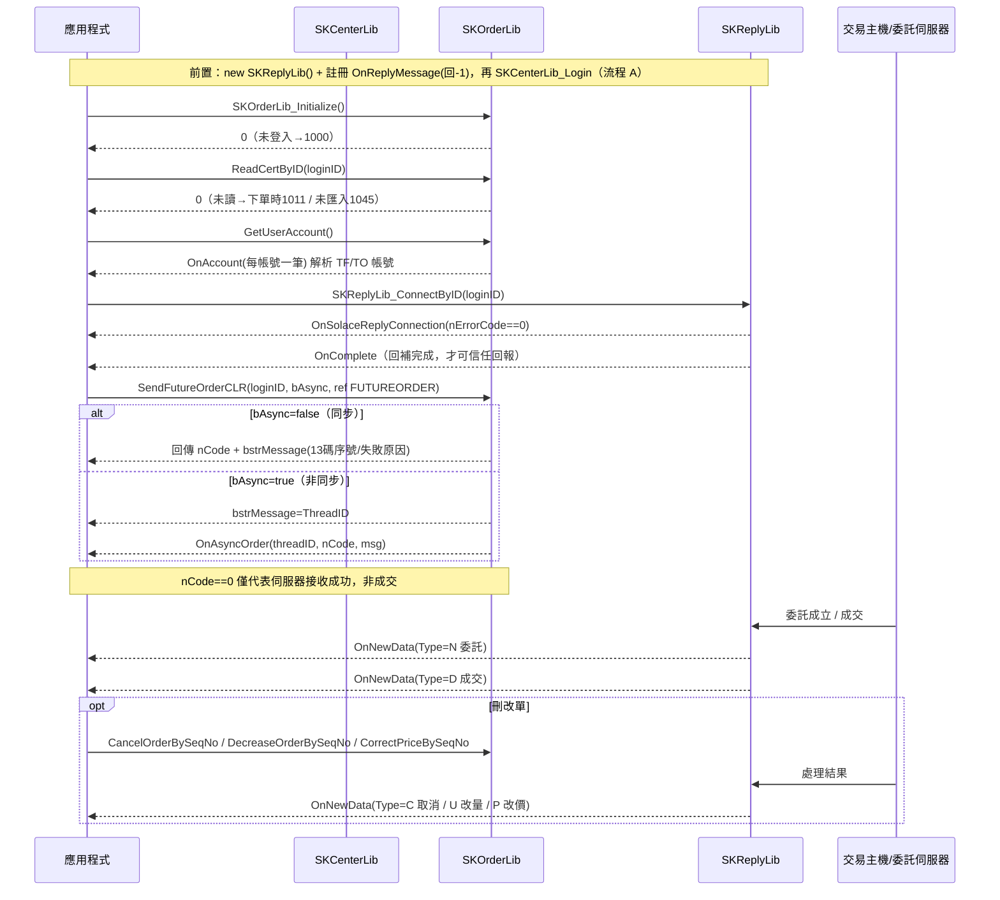

# 流程B：國內期選下單全流程

跨 3 個 lib（SKCenterLib 登入 → SKOrderLib 下單 → SKReplyLib 回報）的端到端開發流程。四條流程中最複雜的一條，特別留意版本陷阱（見 [../modules/SKOrderLib.md](../modules/SKOrderLib.md) 的「陷阱與注意」節）。

## 目標（一句話）

在已完成登入的前提下，以 SKOrderLib 讀憑證、取期貨帳號並送出一筆國內期貨/選擇權委託（`SendFutureOrderCLR`），透過同步回傳或 `OnAsyncOrder` 取得 13 碼委託序號，再由 SKReplyLib 的 `OnNewData` 比對委託/成交狀態，並支援刪改單（Cancel/Decrease/CorrectPrice）。

## 前置條件（引用 modules 節名）

本流程的起點是「登入已完成」，但登入必須符合以下硬性順序，否則後面全都拿不到資料：

1. **回報物件必須在登入前註冊** — 見 [../modules/SKReplyLib.md](../modules/SKReplyLib.md)「初始化與事件註冊」「陷阱與注意」第 1 點：`new SKReplyLib()` 並註冊 `OnReplyMessage`（handler 內 `sConfirmCode = -1`）**必須在 `SKCenterLib_Login` 之前**，否則登入失敗。
2. **登入成功** — SKCenterLib 完成 `SKCenterLib_Login`（見 [../modules/SKCenterLib.md](../modules/SKCenterLib.md)）。登入前需已簽署證券/期貨 API 下單聲明書，否則取不到對應市場帳號（157 / 帳號清單為空）。
3. **下單前置四步** — 見 [../modules/SKOrderLib.md](../modules/SKOrderLib.md)「初始化與事件註冊」「初始化 / 憑證 / 帳號」：`SKOrderLib_Initialize()` → `ReadCertByID()` → `GetUserAccount()`（帳號由 `OnAccount` 回傳）。順序不可省（詳見「陷阱與注意」第 1 點）。
4. **回報連線** — 見 [../modules/SKReplyLib.md](../modules/SKReplyLib.md)「SKReplyLib_ConnectByID」「OnComplete」：`SKReplyLib_ConnectByID()` 後須同時等到 `OnSolaceReplyConnection`（nErrorCode==0）**與** `OnComplete`（回補完成）才算連線成功；否則收不到 `OnNewData`。

> 委託結構、下單函式與刪改單規格見 [../modules/SKOrderLib.md](../modules/SKOrderLib.md)「共用結構物件（Struct）> FUTUREORDER」「方法 > 國內期選下單」「方法 > 國內刪改單」；回報欄位見 [../modules/SKReplyLib.md](../modules/SKReplyLib.md)「事件 > OnNewData」。

## 步驟總表

| # | 呼叫 | 所屬 lib | 說明 | 規格出處 |
|---|---|---|---|---|
| 0a | `new SKReplyLib()` + 註冊 `OnReplyMessage`（回 -1） | SKReplyLib | 登入前必做，否則登入失敗 | [SKReplyLib.md#onreplymessage](../modules/SKReplyLib.md) |
| 0b | `SKCenterLib_Login` | SKCenterLib | 登入（本流程前提，見流程 A） | [SKCenterLib.md](../modules/SKCenterLib.md) |
| 1 | 掛載 SKOrderLib 事件（`OnAccount`/`OnAsyncOrder`…） | SKOrderLib | 事件只掛一次，重複掛會重複觸發 | [SKOrderLib.md#初始化與事件註冊](../modules/SKOrderLib.md) |
| 2 | `SKOrderLib_Initialize()` | SKOrderLib | 下單物件初始化；未登入回 1000 | [SKOrderLib.md#skorderlib_initialize](../modules/SKOrderLib.md) |
| 3 | `ReadCertByID(loginID)` | SKOrderLib | 讀/驗憑證；未讀憑證下單回 1011，未匯入回 1045 | [SKOrderLib.md#readcertbyid](../modules/SKOrderLib.md) |
| 4 | `GetUserAccount()` | SKOrderLib | 取回可交易帳號（結果走事件） | [SKOrderLib.md#getuseraccount](../modules/SKOrderLib.md) |
| 5 | `OnAccount(loginID, data)` | SKOrderLib | 每帳號一筆；解析出期貨帳號（市場=TF/TO） | [SKOrderLib.md#onaccount](../modules/SKOrderLib.md) |
| 6 | (選) `SetMaxQty`/`SetMaxCount`/`UnlockOrder` | SKOrderLib | 每秒委託限制與解鎖（超限回 1040） | [SKOrderLib.md#setmaxqty](../modules/SKOrderLib.md) |
| 7 | `SKReplyLib_ConnectByID(loginID)` | SKReplyLib | 建立回報連線 → 等 `OnSolaceReplyConnection`+`OnComplete` | [SKReplyLib.md#skreplylib_connectbyid](../modules/SKReplyLib.md) |
| 8 | 建構 `FUTUREORDER` 結構 | SKOrderLib | 逐欄填市場/委託條件/當沖/買賣/價格型態/倉別/盤別 | [SKOrderLib.md#futureorder](../modules/SKOrderLib.md) |
| 9 | `SendFutureOrderCLR(loginID, bAsync, ref pOrder, out msg)` | SKOrderLib | 送出期貨委託（新客戶用；可選倉別 `sNewClose`、盤別 `sReserved`）；選擇權用 `SendOptionOrder` | [SKOrderLib.md#sendfutureordercLR](../modules/SKOrderLib.md) |
| 10a | 同步：讀 `bstrMessage`（13 碼序號 / 失敗原因） | SKOrderLib | `bAsync=false` 時直接由 out 參數取回 | [SKOrderLib.md#sendfutureordercLR](../modules/SKOrderLib.md) |
| 10b | 非同步：`OnAsyncOrder(threadID, nCode, msg)` | SKOrderLib | `bAsync=true` 時 `bstrMessage` 只回 ThreadID，結果走事件 | [SKOrderLib.md#onasyncorder](../modules/SKOrderLib.md) |
| 11 | `OnNewData(loginID, bstrData)` | SKReplyLib | 委託(N)→成交(D) 等主動回報，逗號分隔欄位比對 | [SKReplyLib.md#onnewdata](../modules/SKReplyLib.md) |
| 12 | `CancelOrderBySeqNo` / `CancelOrderByBookNo` / `CancelOrderByStockNo(Advance)` | SKOrderLib | 刪單（序號 / 書號 / 商品代號） | [SKOrderLib.md#cancelorderbyseqno](../modules/SKOrderLib.md) |
| 13 | `DecreaseOrderBySeqNo` | SKOrderLib | 委託減量（依 13 碼序號） | [SKOrderLib.md#decreaseorderbyseqno](../modules/SKOrderLib.md) |
| 14 | `CorrectPriceBySeqNo` / `CorrectPriceByBookNo` | SKOrderLib | 改價（序號 / 書號，`bstrMarketSymbol`=TF/TO） | [SKOrderLib.md#correctpricebyseqno](../modules/SKOrderLib.md) |

## FUTUREORDER 欄位逐一說明（一般期選委託）

以 `SendFutureOrderCLR`（期貨）為例，最小必填 + 常用欄位（完整結構見 [../modules/SKOrderLib.md](../modules/SKOrderLib.md)「共用結構物件 > FUTUREORDER」；原始定義 `api_spec/_raw/7.下單-國內期選.md:714-725`）：

| 欄位 | 型別 | 語意（下單分類） | 值 |
|---|---|---|---|
| `bstrFullAccount` | string | 期貨帳號 | Broker id（例 `F020000`）＋帳號 7 碼 |
| `bstrStockNo` | string | 委託商品（市場別/商品） | 近月代碼 `TX00`/`MTX00`；或指定月份 `TX03`（過期自動隔年）；價差單填「近月/遠月」如 `TX12/01` |
| `sTradeType` | short | 委託條件（時效） | 一般單 `0:ROD` `1:IOC` `2:FOK`（智慧單另用 0/3/4） |
| `sBuySell` | short | 買賣 | `0:買進` `1:賣出`（價差單為近月方向） |
| `sDayTrade` | short | 當沖 | `0:否` `1:是`（可當沖商品依交易所規定；不支援回 1015） |
| `sNewClose` | short | 倉別 | `0:新倉` `1:平倉` `2:自動`（**僅 `SendFutureOrderCLR`/新期選有效**；超範圍回 1012） |
| `bstrPrice` | string | 價格型態（委託價） | 限價填數字字串；IOC/FOK 可用 `M`（市價）/`P`（範圍市價）。**智慧單請改用 `nOrderPriceType`，勿用 P** |
| `nQty` | int | 口數 | 交易口數（非數字回 1014） |
| `sReserved` | short | 盤別 | `0:盤中(T盤及T+1盤)` `1:T盤預約`（**僅 `SendFutureOrderCLR` 有效**；`SendFutureOrder` 固定盤中；超範圍回 1046） |
| `bstrCIDTandem` + `bstrSettlementMonth` | string | 指定月份（替代寫法，V2.13.54+） | `FITX` + `202503`（與 `bstrStockNo=TX03` 二擇一） |

> 選擇權委託改用 `SendOptionOrder`（同結構，另填履約價/CallPut 由商品代號帶入）；複式單用 `SendDuplexOrder`（填 `bstrStockNo2`/`sBuySell2`，`sTradeType` 僅 IOC/FOK，價格算法見 `api_spec/_raw/7.下單-國內期選.md:311`）。

## SendFutureOrderCLR / SendFutureOrder 差異

| | `SendFutureOrderCLR` | `SendFutureOrder`（舊） |
|---|---|---|
| 倉別 `sNewClose` | 有效（可新倉/平倉/自動） | 無效（不填倉位） |
| 盤別 `sReserved` | 有效（可 T 盤預約） | 無效（固定盤中，不可改） |
| 建議 | **新客戶一律用此** | 官方文件已導向 CLR |

## 同步 vs 非同步旗標（`bAsyncOrder`）

| `bAsyncOrder` | `bstrMessage` 內容 | 結果取得方式 |
|---|---|---|
| `false`（同步） | 成功＝13 碼委託序號；失敗＝失敗原因 | 呼叫後直接讀 `out bstrMessage` |
| `true`（非同步） | 只回 Thread ID | `OnAsyncOrder(nThreadID, nCode, bstrMessage)`，以 `nThreadID` 對應此次下單來源 |

**關鍵：回傳 `nCode==0` 只代表「委託伺服器接收成功」，不等於成交**；實際狀態一律以 `OnNewData` 回報（或被動查詢）為準。刪改單家族 (`Cancel*`/`Decrease*`/`CorrectPrice*`) 同樣支援 `bAsyncOrder`，非同步結果也走 `OnAsyncOrder`。

## OnNewData 回報比對（13 欄關鍵欄）

`OnNewData(bstrUserID, bstrData)`，`bstrData` 以 `,` 分隔。**先判斷 `values[0]=="980"`（後台問題訊息，非標準格式）再解析**。國內期選下單追蹤最關鍵的 13 欄（index 為 `Split(',')` 後 0-based；完整 49 欄見 [../modules/SKReplyLib.md](../modules/SKReplyLib.md)「事件 > OnNewData」）：

| # | 欄位 | 比對用途 |
|---|---|---|
| 0 | `KeyNo` | 原始 13 碼委託序號 — 對應下單同步回傳/`OnAsyncOrder` 的序號 |
| 1 | `MarketType` | `TF` 期貨 / `TO` 選擇權 — 篩選市場 |
| 2 | `Type` | `N` 委託 / `C` 取消 / `U` 改量 / `P` 改價 / `D` 成交 / `B` 改價改量 / `S` 動態退單 — 判斷回報種類 |
| 3 | `OrderErr` | `Y` 失敗 / `T` 逾時 / `N` 正常 — 委託是否被接受 |
| 5 | `CustNo` | 交易帳號 — 對應下單帳號 |
| 6 | `BuySell` | 買賣別 |
| 8 | `ComId` | 商品代碼 |
| 10 | `OrderNo` | 委託書號（改價/刪單 by 書號時用） |
| 11 | `Price` | 價格（`N`=委託價 / `D`=成交價） |
| 20 | `Qty` | 口數 |
| 24 | `Time` | 交易時間 |
| 38 | `ExecutionNo` | 成交序號（成交比對請以此為主，**勿用 OkSeq(25)**） |
| 47 | `SeqNo` | 13 碼序號（成交單含 IOC/FOK 產生取消單之比對，V2.13.38+） |

補充：`Reserved`(40) = 盤別（A:T 盤 / B:T+1 盤）、`CallPut`(42) 選擇權類型、`ErrorMsg`(44) 退單訊息、`StrikePrice1/2`(34/37) 履約價（**勿用舊保留欄 index 9**）也常用於期選比對。一筆委託的典型生命週期：先收 `Type=N`（委託成立）→ 成交時收 `Type=D`；被動態退單會依序收委託回報、取消回報、退單回報（`CancelOrderMarkByExchange`=E）。

## 刪改單家族

| 動作 | 函式 | 定位鍵 | 備註 |
|---|---|---|---|
| 刪單 | `CancelOrderBySeqNo` | 13 碼序號 | 最常用 |
| 刪單 | `CancelOrderByBookNo` | 5 碼書號 | |
| 刪單 | `CancelOrderByStockNo` | 商品代號 | **空字串＝刪帳號下全部委託**（V2.13.52 行為變更） |
| 刪單 | `CancelOrderByStockNoAdvance` | 商品代號+買賣別+價格 | 精準刪單 |
| 減量 | `DecreaseOrderBySeqNo` | 13 碼序號 | `nDecreaseQty`=要減的量 |
| 改價 | `CorrectPriceBySeqNo` | 13 碼序號 | `nTradeType`：期選 0/1/2 |
| 改價 | `CorrectPriceByBookNo` | 5 碼書號 | 需帶 `bstrMarketSymbol`（TF/TO） |

## 最小可運作 C# 骨架

> 拼接自官方範例；每段標註來源（路徑相對 repo 根目錄:行號）。委託結構的 `pOrder` 在 SKCOMTesterV2 的 Interop 以 `ref` 傳遞、在 SKCOMTester 直接傳值——**依你實際引用的 `Interop.SKCOMLib` 簽名為準**（見 [../modules/SKOrderLib.md](../modules/SKOrderLib.md)「陷阱與注意」第 18 點）。以下採 V2 的 `ref` 寫法。

```csharp
using SKCOMLib; // Interop.SKCOMLib

// ── 物件宣告（來源：SKCOMTesterV2/WindowsFormsApp1/MainForm.cs:19-21）──
SKCenterLib m_pSKCenter = new SKCenterLib(); // 登入&環境設定
SKReplyLib  m_pSKReply  = new SKReplyLib();  // 回報（必須登入前建立）
SKOrderLib  m_pSKOrder  = new SKOrderLib();  // 下單
string m_strLoginID = "身分證字號";           // 大寫
string m_strFutureAccount = "";               // 由 OnAccount 組出

// ── 步驟 0a：登入前註冊公告（來源：SKCOMTesterV2/.../MainForm.cs:191-200；SKReplyLib.md#onreplymessage）──
m_pSKReply.OnReplyMessage += (string strUserID, string bstrMessage, out short nConfirmCode) =>
{
    nConfirmCode = -1; // 未回 -1 將無法正確登入
};

// ── 步驟 1：掛載下單/回報事件（只掛一次；來源：SKCOMTester/SKOrder.cs:353-354,137；SKReply.cs:279-285）──
m_pSKOrder.OnAccount    += new _ISKOrderLibEvents_OnAccountEventHandler(OnAccount);
m_pSKOrder.OnAsyncOrder += new _ISKOrderLibEvents_OnAsyncOrderEventHandler(OnAsyncOrder);
m_pSKReply.OnSolaceReplyConnection += new _ISKReplyLibEvents_OnSolaceReplyConnectionEventHandler(OnSolaceReplyConnection);
m_pSKReply.OnComplete   += new _ISKReplyLibEvents_OnCompleteEventHandler(OnComplete);
m_pSKReply.OnNewData    += new _ISKReplyLibEvents_OnNewDataEventHandler(OnNewData);

// ……此處呼叫 m_pSKCenter.SKCenterLib_Login(...)（流程 A）……

// ── 步驟 2~4：下單前置（來源：SKCOMTester/SKOrder.cs:382,394,411）──
int nCode = m_pSKOrder.SKOrderLib_Initialize();          // 未登入→1000
// 檢查 nCode，非 0 用 m_pSKCenter.SKCenterLib_GetReturnCodeMessage(nCode) 取訊息
nCode = m_pSKOrder.ReadCertByID(m_strLoginID);           // 未讀憑證下單→1011；未匯入→1045
nCode = m_pSKOrder.GetUserAccount();                     // 帳號走 OnAccount

// ── 步驟 5：OnAccount 解析期貨帳號（來源：SKCOMTester/SKOrder.cs:86-108）──
void OnAccount(string bstrLogInID, string bstrAccountData)
{
    // 逗點分隔：市場,分公司代碼,分公司,帳號,身分證,姓名（期貨:分公司代碼=Broker id）
    string[] v = bstrAccountData.Split(',');
    if (v[0] == "TF" || v[0] == "TO")             // 期貨 / 選擇權市場
        m_strFutureAccount = v[1] + v[3];         // Broker id + 帳號7碼
}

// ── 步驟 7：回報連線（來源：SKCOMTesterV2/.../ReplyForm.cs:1807；SKReplyLib.md#skreplylib_connectbyid）──
nCode = m_pSKReply.SKReplyLib_ConnectByID(m_strLoginID);
void OnSolaceReplyConnection(string id, int err) { /* err==0 才代表連上，仍須等 OnComplete */ }
void OnComplete(string id) { /* 回補完成，開始可信任 OnNewData */ }

// ── 步驟 8~10：建構 FUTUREORDER 並送出（來源：SKCOMTesterV2/.../Order/SendOrderForm/TFSendOrderForm.cs:101-151）──
void SendFuture(bool bAsyncOrder)
{
    FUTUREORDER pOrder = new FUTUREORDER();
    pOrder.bstrFullAccount = m_strFutureAccount;   // Broker id + 帳號7碼
    pOrder.bstrStockNo     = "TX00";               // 近月台指期；指定月份可用 "TX03"
    pOrder.sTradeType      = 0;                     // 0:ROD 1:IOC 2:FOK
    pOrder.sBuySell        = 0;                     // 0:買進 1:賣出
    pOrder.sDayTrade       = 0;                     // 0:否 1:是（當沖）
    pOrder.sNewClose       = 0;                     // 0:新倉 1:平倉 2:自動
    pOrder.bstrPrice       = "17500";              // 限價；IOC/FOK 可填 "M"/"P"
    pOrder.nQty            = 1;                     // 口數
    pOrder.sReserved       = 0;                     // 0:盤中(T盤及T+1盤) 1:T盤預約

    string bstrMessage;
    int c = m_pSKOrder.SendFutureOrderCLR(m_strLoginID, bAsyncOrder, ref pOrder, out bstrMessage);
    // c==0 僅代表委託伺服器接收成功，非成交
    if (bAsyncOrder == false)
    {
        // 同步：bstrMessage = 13 碼委託序號（成功）或失敗原因
        // …保存序號供後續刪改單比對…
    }
    // 非同步：bstrMessage = ThreadID，結果由下面 OnAsyncOrder 回
}

// ── 步驟 10b：非同步委託結果（來源：SKCOMTester/SKOrder.cs:137-140）──
void OnAsyncOrder(int nThreadID, int nCode, string bstrMessage)
{
    // nCode==0：bstrMessage = 委託序號；非 0：失敗原因。用 nThreadID 對應送單來源
}

// ── 步驟 11：OnNewData 回報比對（來源：SKCOMTesterV2/.../ReplyForm.cs:1425-1500）──
void OnNewData(string bstrUserID, string bstrData)
{
    string[] values = bstrData.Split(',');
    if (values.Length > 0 && values[0] == "980") return; // 後台問題訊息，非標準格式
    if (values.Length < 48) return;                       // 防禦式：欄數隨版本增加，用「至少 N 欄」
    string keyNo   = values[0];   // 原始 13 碼委託序號
    string market  = values[1];   // TF / TO
    string type    = values[2];   // N委託 / D成交 / C取消 / U改量 / P改價 / S動態退單
    string orderErr= values[3];   // Y失敗 / T逾時 / N正常
    string comId   = values[8];   // 商品代碼
    string orderNo = values[10];  // 委託書號
    string price   = values[11];  // N=委託價 / D=成交價
    string qty     = values[20];  // 口數
    string execNo  = values[38];  // 成交序號（勿用 OkSeq）
    string seqNo   = values[47];  // 13 碼序號（IOC/FOK 取消單比對）
    // 依 keyNo/seqNo 對應先前下單，依 type 更新委託狀態
}

// ── 步驟 12~14：刪改單（來源：SKCOMTesterV2/.../Order/UpdateOrderForm/TSTFUpdateOrderForm.cs:77-193）──
void CancelBySeqNo(string seqNo)
{
    string msg;
    int c = m_pSKOrder.CancelOrderBySeqNo(m_strLoginID, false, m_strFutureAccount, seqNo, out msg);
}
void DecreaseBySeqNo(string seqNo, int decQty)
{
    string msg;
    int c = m_pSKOrder.DecreaseOrderBySeqNo(m_strLoginID, false, m_strFutureAccount, seqNo, decQty, out msg);
}
void CorrectPriceBySeqNo(string seqNo, string newPrice)
{
    string msg; int nTradeType = 0; // 期選 0:ROD 1:IOC 2:FOK
    int c = m_pSKOrder.CorrectPriceBySeqNo(m_strLoginID, false, m_strFutureAccount, seqNo, newPrice, nTradeType, out msg);
}
```

## Mermaid sequenceDiagram



## 常見錯誤與檢查點

回傳碼語意與完整對照見 [../error_codes.md](../error_codes.md)；下方為本流程高頻踩雷點（詳見 [../modules/SKOrderLib.md](../modules/SKOrderLib.md)「陷阱與注意」）。

| 症狀 / 回傳碼 | 原因 | 處理 |
|---|---|---|
| `1000` SK_ERROR_LOGIN_FIRST | 未先登入就 Initialize，或登入 ID 未大寫 | 先 `SKCenterLib_Login`；ID 用大寫 |
| `1011` SK_ERROR_ORDER_SIGN_INVALID | 下單前未 `ReadCertByID` | 前置四步依序執行，勿跳過讀憑證 |
| `1038` SK_ERROR_CERT_NOT_VERIFIED | 憑證尚未驗章 | 先執行 `ReadCertByID` |
| `1045` SK_ERROR_CERT_NOT_FOUND | 憑證不存在 | 先匯入憑證 |
| `157` SK_ERROR_LOGIN_NO_ACCONTS / 帳號清單空 | 未簽 API 下單聲明書 | 簽署後**重新登入**再 `GetUserAccount` |
| `1002/1003` 帳號不存在/類型不符 | 帳號組錯（Broker id+7 碼）、拿證券帳號下期貨 | 依 `OnAccount` 的 `TF/TO` 市場取帳號 |
| `1013` 商品不存在 | `bstrStockNo` 代碼錯或非近月未填月份 | 用近月代碼 `TX00`，或指定月份 `TX03`／`CIDTandem+SettlementMonth` |
| `1010/1015` 當沖超範圍/不支援 | `sDayTrade` 值錯或商品不可當沖 | 依交易所規定設 `sDayTrade` |
| `1012` NEW_CLOSE 超範圍 | `sNewClose` 值錯 | 0/1/2；且僅 `SendFutureOrderCLR` 有效 |
| `1046` 委託盤別超範圍 | `sReserved` 值錯 | 0/1；`SendFutureOrder` 不吃盤別（固定盤中） |
| `1017` 下單價格錯誤 | `bstrPrice` 非數字且非 M/P；或 ROD 用了 M/P | ROD 給限價數字；M/P 僅 IOC/FOK |
| `1040` SK_ERROR_ORDER_LOCK | 每秒委託超過 `SetMaxQty`/`SetMaxCount` | 呼叫 `UnlockOrder(nMarketType)` 解鎖 |
| `1090/1091` 序號/書號有誤 | 刪改單定位鍵填錯 | 用 `OnNewData` 取得的 `KeyNo`/`OrderNo` |
| `1107` 限近月商品代碼 | 智慧單非 V1 系列用了指定月份 | 用 V1 系列並填 `bstrSettlementMonth`（否則非近月未填回 `2030`） |
| `2010` 提醒簽署期貨智慧單風險預告書 | 送期貨智慧單前未簽 | 簽署後再下智慧單（本流程一般單不需） |
| 收不到 `OnNewData` | 回報連線只等到 `OnSolaceReplyConnection`、漏等 `OnComplete`；或 Reply 物件未在登入前註冊 | 兩事件都到才算連上；`OnReplyMessage` 必須登入前註冊回 -1 |
| `nCode==0` 卻沒成交 | 誤把「接收成功」當「成交」 | 一律以 `OnNewData`（Type=D）或被動查詢確認 |
| 解析 `OnNewData` 例外 | 誤用固定欄數、把 `980` 當正常資料、讀舊保留欄 index 9 | 先判 `values[0]=="980"`；用「至少 N 欄」；履約價看 `StrikePrice1/2`、成交序號看 `ExecutionNo` |
| `SendFutureOrderCLR` 編譯/呼叫錯 | `ref` vs 傳值不符所引用的 Interop | 依實際 `Interop.SKCOMLib` 簽名（V2=`ref`，SKCOMTester=傳值） |
