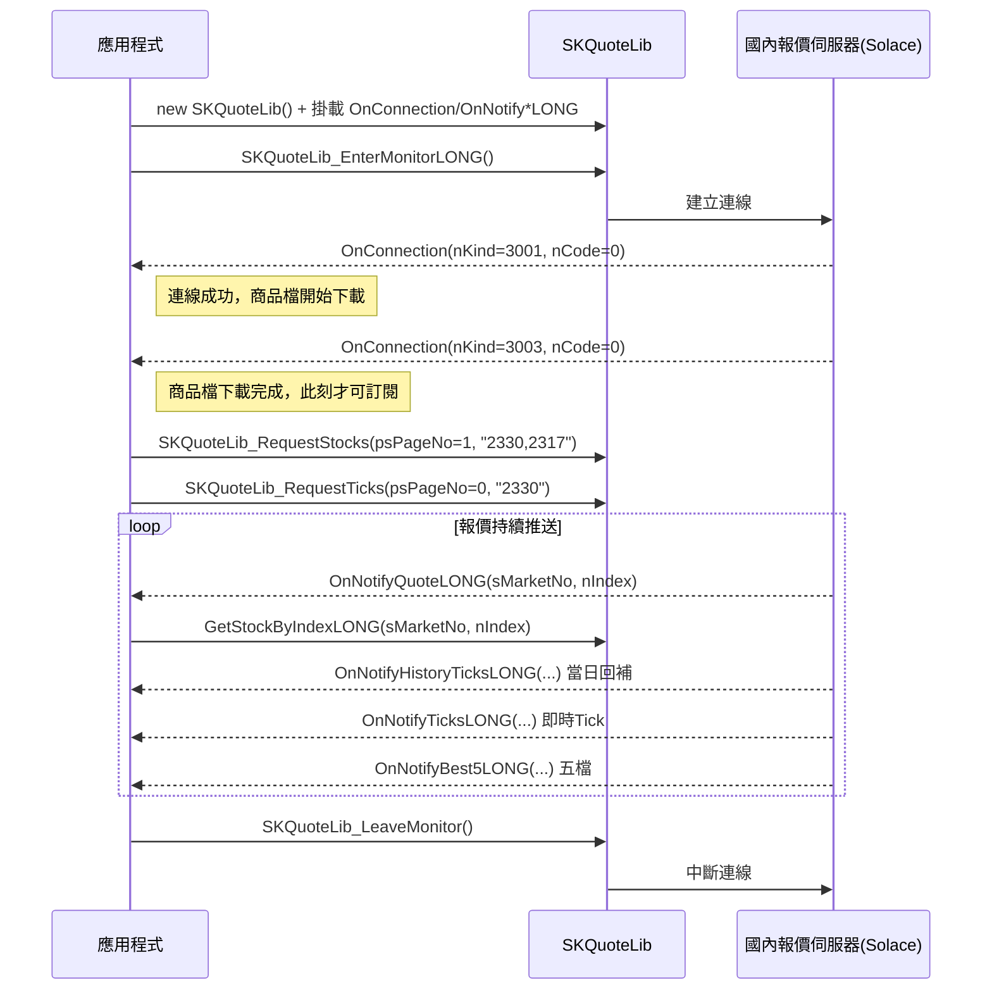
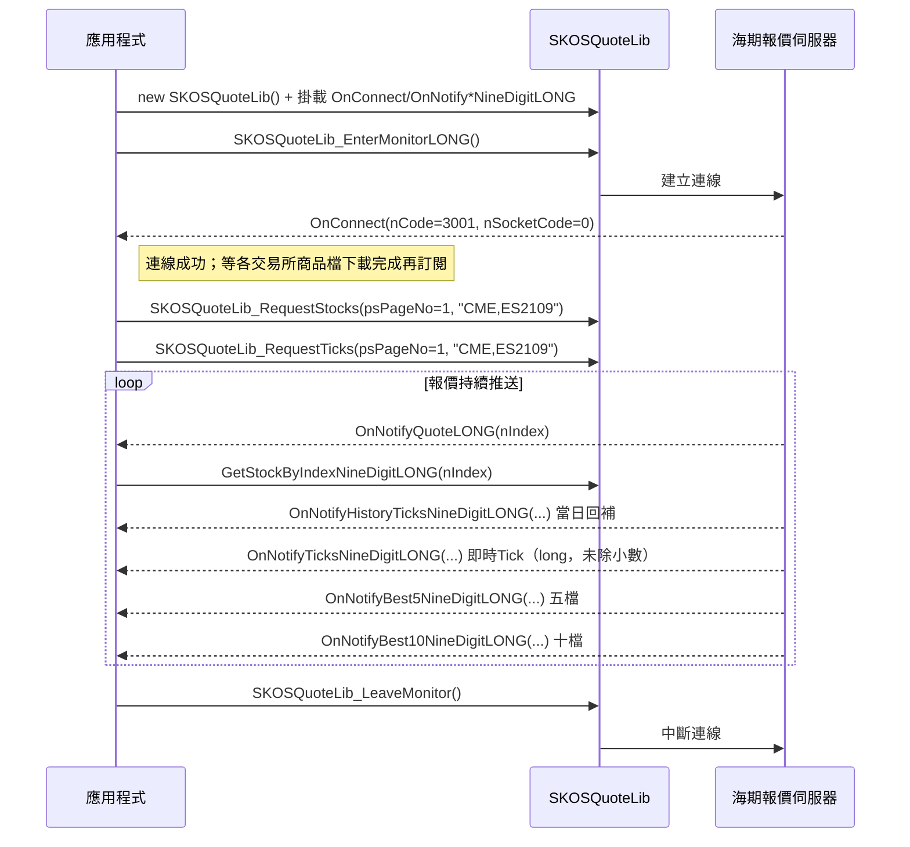
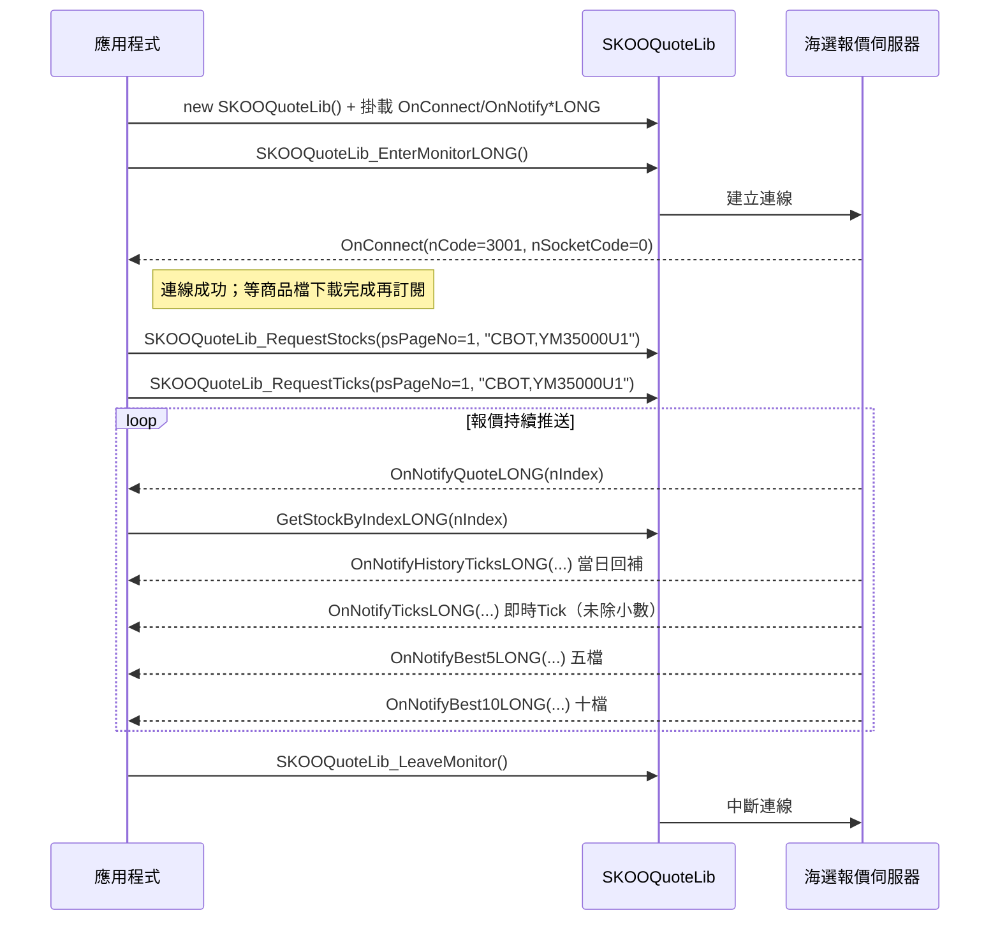

# 流程C：報價訂閱三型（國內／海期／海選）

## 目標（一句話）

依國內（`SKQuoteLib`）、海外期貨（`SKOSQuoteLib`）、海外選擇權（`SKOOQuoteLib`）三支報價元件，各自完整走一次「連線 → 等待就緒 → 訂閱 → 接收事件 → 退出」的生命週期，讓 AI 能照抄本檔拼出可編譯、可運作的三種即時報價收單程式。

## 前置條件

三段皆共用以下前置（缺一則後面全部失敗）：

- 登入前必須先建立 `SKReplyLib` 物件並註冊 `OnReplyMessage` 事件（handler 內回傳 `sConfirmCode = -1`），否則 `SKCenterLib_Login` 失敗（錯誤碼 2017 相關）——`modules/SKReplyLib.md#OnReplyMessage`、`modules/SKReplyLib.md#陷阱與注意`
- `SKCenterLib_Login(帳號, 密碼)` 登入成功——`modules/SKCenterLib.md#SKCenterLib_Login`
- （選用）以 `SKCenterLib_RequestAgreement` 確認證券／期貨 API 下單聲明書簽署狀態；預設登入時已自動查詢一次——`modules/SKCenterLib.md#SKCenterLib_RequestAgreement`

各段額外前置：

| 段別 | 額外前置 | 出處 |
|---|---|---|
| 國內 SKQuoteLib | 需開立證券或期貨帳戶並簽署對應 API 下單同意書，否則對應市場查詢／訂閱回錯誤碼 3031 | `modules/SKQuoteLib.md#陷阱與注意`（第 10 點） |
| 海期 SKOSQuoteLib | 需先簽署期貨 API 下單聲明書 | `modules/SKOSQuoteLib.md#初始化與事件註冊`、`modules/SKOSQuoteLib.md#SKOSQuoteLib_EnterMonitorLONG` |
| 海選 SKOOQuoteLib | 需先簽署期貨 API 下單聲明書 | `modules/SKOOQuoteLib.md#SKOOQuoteLib_EnterMonitorLONG` |

事件掛載一律要在呼叫對應 `EnterMonitorLONG` **之前**完成（見三份 modules 檔各自的「初始化與事件註冊」節）。三個報價物件（`SKQuoteLib`／`SKOSQuoteLib`／`SKOOQuoteLib`）互相獨立，可同時建立、平行連線，不互相影響。

## 步驟總表

| # | 呼叫 | 所屬 lib | 說明 | 規格出處（modules/xx.md#節名） |
|---|---|---|---|---|
| 1 | `new SKReplyLib()` + 註冊 `OnReplyMessage`（回傳 `sConfirmCode=-1`） | SKReplyLib | 登入前必做的公告事件註冊 | `modules/SKReplyLib.md#OnReplyMessage` |
| 2 | `SKCenterLib_Login(bstrUserID, bstrPassword)` | SKCenterLib | 雙因子登入，三段報價的共同前提 | `modules/SKCenterLib.md#SKCenterLib_Login` |
| 3 | `new SKQuoteLib()` 並掛載 `OnConnection`／`OnNotifyQuoteLONG`／`OnNotifyTicksLONG`／`OnNotifyHistoryTicksLONG`／`OnNotifyBest5LONG` | SKQuoteLib | 國內報價物件建立＋事件掛載（須在 EnterMonitorLONG 之前） | `modules/SKQuoteLib.md#初始化與事件註冊` |
| 4 | `SKQuoteLib_EnterMonitorLONG()` | SKQuoteLib | 與國內報價伺服器建立連線 | `modules/SKQuoteLib.md#SKQuoteLib_EnterMonitorLONG` |
| 5 | 等待 `OnConnection(nKind=3001)` 再等 `OnConnection(nKind=3003)` | SKQuoteLib | 3001=連線成功、3003=商品檔下載完成；3003 之前訂閱一律失敗 | `modules/SKQuoteLib.md#OnConnection` |
| 6 | `SKQuoteLib_RequestStocks(ref psPageNo, "2330,2317")`（psPageNo 固定帶 1）或 `SKQuoteLib_RequestStocksWithMarketNo(ref psPageNo, sMarketNo, ...)`（盤中零股／客製化期選，psPageNo 同樣固定帶 1） | SKQuoteLib | 訂閱即時報價（100 檔上限，兩函式擇一） | `modules/SKQuoteLib.md#SKQuoteLib_RequestStocks` |
| 7 | `SKQuoteLib_RequestTicks(ref psPageNo, "2330")`（psPageNo 從 0 開始） | SKQuoteLib | 訂閱成交明細＋五檔（含當日回補，10 檔上限） | `modules/SKQuoteLib.md#SKQuoteLib_RequestTicks` |
| 8 | 接收 `OnNotifyQuoteLONG` / `OnNotifyHistoryTicksLONG` / `OnNotifyTicksLONG` / `OnNotifyBest5LONG` | SKQuoteLib | `OnNotifyQuoteLONG` 內以 `(sMarketNo, nIndex)` 呼叫 `GetStockByIndexLONG` 取完整報價物件 | `modules/SKQuoteLib.md#OnNotifyQuoteLONG` |
| 9 | `SKQuoteLib_LeaveMonitor()` | SKQuoteLib | 中斷國內報價連線（含回報，不含模擬回報／公告） | `modules/SKQuoteLib.md#SKQuoteLib_LeaveMonitor` |
| 10 | `new SKOSQuoteLib()` 並掛載 `OnConnect`／`OnNotifyQuoteLONG`／`OnNotifyTicksNineDigitLONG`／`OnNotifyHistoryTicksNineDigitLONG`／`OnNotifyBest5NineDigitLONG`／`OnNotifyBest10NineDigitLONG` | SKOSQuoteLib | 海期報價物件建立＋事件掛載 | `modules/SKOSQuoteLib.md#初始化與事件註冊` |
| 11 | `SKOSQuoteLib_EnterMonitorLONG()` | SKOSQuoteLib | 與海期報價伺服器建立連線 | `modules/SKOSQuoteLib.md#SKOSQuoteLib_EnterMonitorLONG` |
| 12 | 等待 `OnConnect(nCode=3001, nSocketCode=0)` | SKOSQuoteLib | 3001=連線成功；商品檔（各交易所）未下載完成前訂閱會失敗，實務上等 log（`日期_OSQuote.log` 的 `LoadOSCommdity`）出現後再訂閱 | `modules/SKOSQuoteLib.md#OnConnect` |
| 13 | `SKOSQuoteLib_RequestStocks(ref psPageNo, "CME,ES2109")`（psPageNo 固定帶 1） | SKOSQuoteLib | 訂閱海期即時報價；商品格式「交易所代碼,商品報價代碼」，多筆以 `#` 分隔 | `modules/SKOSQuoteLib.md#SKOSQuoteLib_RequestStocks` |
| 14 | `SKOSQuoteLib_RequestTicks(ref psPageNo, "CME,ES2109")`（psPageNo 從 1 開始） | SKOSQuoteLib | 訂閱成交明細＋五檔＋十檔（九位小數擴充，含當日回補） | `modules/SKOSQuoteLib.md#SKOSQuoteLib_RequestTicks` |
| 15 | 接收 `OnNotifyQuoteLONG` / `OnNotifyHistoryTicksNineDigitLONG` / `OnNotifyTicksNineDigitLONG` / `OnNotifyBest5NineDigitLONG` / `OnNotifyBest10NineDigitLONG` | SKOSQuoteLib | 價格為 `long` 且未除小數，需依 `SKFOREIGN_9LONG.sDecimal`／`nDenominator` 自行換算 | `modules/SKOSQuoteLib.md#OnNotifyTicksNineDigitLONG` |
| 16 | `SKOSQuoteLib_LeaveMonitor()` | SKOSQuoteLib | 中斷海期報價連線 | `modules/SKOSQuoteLib.md#SKOSQuoteLib_LeaveMonitor` |
| 17 | `new SKOOQuoteLib()` 並掛載 `OnConnect`／`OnNotifyQuoteLONG`／`OnNotifyTicksLONG`／`OnNotifyHistoryTicksLONG`／`OnNotifyBest5LONG`／`OnNotifyBest10LONG` | SKOOQuoteLib | 海選報價物件建立＋事件掛載 | `modules/SKOOQuoteLib.md#初始化與事件註冊` |
| 18 | `SKOOQuoteLib_EnterMonitorLONG()` | SKOOQuoteLib | 與海選報價伺服器建立連線 | `modules/SKOOQuoteLib.md#SKOOQuoteLib_EnterMonitorLONG` |
| 19 | 等待 `OnConnect(nCode=3001, nSocketCode=0)` | SKOOQuoteLib | 3001=連線成功；商品檔未下載完成前訂閱會失敗 | `modules/SKOOQuoteLib.md#OnConnect` |
| 20 | `SKOOQuoteLib_RequestStocks(ref psPageNo, "CBOT,YM35000U1")`（psPageNo 固定帶 1） | SKOOQuoteLib | 訂閱海選即時報價 | `modules/SKOOQuoteLib.md#SKOOQuoteLib_RequestStocks` |
| 21 | `SKOOQuoteLib_RequestTicks(ref psPageNo, "CBOT,YM35000U1")`（psPageNo 從 1 開始） | SKOOQuoteLib | 訂閱成交明細＋五檔＋十檔（含當日回補） | `modules/SKOOQuoteLib.md#SKOOQuoteLib_RequestTicks` |
| 22 | 接收 `OnNotifyQuoteLONG` / `OnNotifyHistoryTicksLONG` / `OnNotifyTicksLONG` / `OnNotifyBest5LONG` / `OnNotifyBest10LONG` | SKOOQuoteLib | 價格未除小數，需依 `SKFOREIGNLONG.sDecimal` 自行換算；沒有海期的九位小數擴充版本 | `modules/SKOOQuoteLib.md#OnNotifyTicksLONG` |
| 23 | `SKOOQuoteLib_LeaveMonitor()` | SKOOQuoteLib | 中斷海選報價連線 | `modules/SKOOQuoteLib.md#SKOOQuoteLib_LeaveMonitor` |

## 最小可運作 C# 骨架

三段各自獨立成一個檔案／類別即可平行運作；下面依官方範例逐段拼接，每段皆註明來源檔案與行號。

### 段一：國內 SKQuoteLib

```csharp
using SKCOMLib;   // 引用 Interop.SKCOMLib.dll
// 出處：Source_code/CapitalAPI_2.13.57_CExample/SKCOMTester/SKQuote.cs:9(using)

SKCOMLib.SKQuoteLib m_SKQuoteLib = new SKCOMLib.SKQuoteLib();
// 出處：SKCOMTester/SKQuote.cs:39（欄位宣告）

// 事件掛載：務必在 EnterMonitorLONG 之前完成，且只掛一次
// 出處：SKCOMTester/SKQuote.cs:124-143
m_SKQuoteLib.OnConnection             += new _ISKQuoteLibEvents_OnConnectionEventHandler(m_SKQuoteLib_OnConnection);
m_SKQuoteLib.OnNotifyQuoteLONG        += new _ISKQuoteLibEvents_OnNotifyQuoteLONGEventHandler(m_SKQuoteLib_OnNotifyQuote);
m_SKQuoteLib.OnNotifyHistoryTicksLONG += new _ISKQuoteLibEvents_OnNotifyHistoryTicksLONGEventHandler(m_SKQuoteLib_OnNotifyHistoryTicks);
m_SKQuoteLib.OnNotifyTicksLONG        += new _ISKQuoteLibEvents_OnNotifyTicksLONGEventHandler(m_SKQuoteLib_OnNotifyTicks);
m_SKQuoteLib.OnNotifyBest5LONG        += new _ISKQuoteLibEvents_OnNotifyBest5LONGEventHandler(m_SKQuoteLib_OnNotifyBest5);

// 連線
// 出處：SKCOMTester/SKQuote.cs:147
int m_nCode = m_SKQuoteLib.SKQuoteLib_EnterMonitorLONG();

// OnConnection：3001=連線、3002=斷線、3003=商品檔下載完成
// 出處：SKCOMTester/SKQuote.cs:404-430（節錄，事件內嚴禁呼叫 EnterMonitorLONG/RequestStocks 等）
void m_SKQuoteLib_OnConnection(int nKind, int nCode)
{
    if (nKind == 3001 && nCode == 0)      { /* 連線成功，等待商品檔下載 */ }
    else if (nKind == 3002)               { /* 斷線 */ }
    else if (nKind == 3003)               { /* 商品檔下載完成，此刻才可以訂閱 */ StartSubscribe(); }
}

// 訂閱：收到 3003 之後才呼叫。psPageNo 固定帶 1（見「常見錯誤」psPageNo 陷阱）
void StartSubscribe()
{
    short sPage = 1;
    // 出處：SKCOMTester/SKQuote.cs:269
    m_nCode = m_SKQuoteLib.SKQuoteLib_RequestStocks(ref sPage, "2330,2317");

    short sTickPage = 0;
    // 出處：SKCOMTester/SKQuote.cs:182
    m_nCode = m_SKQuoteLib.SKQuoteLib_RequestTicks(ref sTickPage, "2330");
}

// 出處：SKCOMTester/SKQuote.cs:456-463（節錄）
void m_SKQuoteLib_OnNotifyQuote(short sMarketNo, int nStockIdx)
{
    SKSTOCKLONG pSKStockLONG = new SKSTOCKLONG();
    m_SKQuoteLib.SKQuoteLib_GetStockByIndexLONG(sMarketNo, nStockIdx, ref pSKStockLONG);
    // pSKStockLONG.nClose / 100.0 等欄位即為報價
}

// 出處：SKCOMTester/SKQuote.cs:466（簽名節錄，內容處理略）
void m_SKQuoteLib_OnNotifyTicks(short sMarketNo, int nStockIdx, int nPtr, int nDate,
    int nTimehms, int nTimemillismicros, int nBid, int nAsk, int nClose, int nQty, int nSimulate) { /* ... */ }

void m_SKQuoteLib_OnNotifyHistoryTicks(short sMarketNo, int nStockIdx, int nPtr, int nDate,
    int nTimehms, int nTimemillismicros, int nBid, int nAsk, int nClose, int nQty, int nSimulate) { /* ... */ }

void m_SKQuoteLib_OnNotifyBest5(short sMarketNo, int nStockIdx, /* ...25 個五檔價量參數... */ int nSimulate) { /* ... */ }

// 退出
// 出處：SKCOMTester/SKQuote.cs:154
m_nCode = m_SKQuoteLib.SKQuoteLib_LeaveMonitor();
```

### 段二：海期 SKOSQuoteLib

```csharp
using SKCOMLib;
// 出處：Source_code/CapitalAPI_2.13.57_CExample/SKCOMTester/SKOSQuote.cs:9

SKCOMLib.SKOSQuoteLib m_SKOSQuoteLib = new SKCOMLib.SKOSQuoteLib();
// 出處：SKCOMTester/SKOSQuote.cs:25

// 出處：SKCOMTester/SKOSQuote.cs:97-107
m_SKOSQuoteLib.OnConnect                        += new _ISKOSQuoteLibEvents_OnConnectEventHandler(OnConnect);
m_SKOSQuoteLib.OnNotifyQuoteLONG                += new _ISKOSQuoteLibEvents_OnNotifyQuoteLONGEventHandler(OnQuoteUpdate);
m_SKOSQuoteLib.OnNotifyTicksNineDigitLONG        += new _ISKOSQuoteLibEvents_OnNotifyTicksNineDigitLONGEventHandler(OnNotifyTicksNineLONG);
m_SKOSQuoteLib.OnNotifyHistoryTicksNineDigitLONG += new _ISKOSQuoteLibEvents_OnNotifyHistoryTicksNineDigitLONGEventHandler(OnNotifyHistoryTicksNineLONG);
m_SKOSQuoteLib.OnNotifyBest5NineDigitLONG        += new _ISKOSQuoteLibEvents_OnNotifyBest5NineDigitLONGEventHandler(OnNotifyBest5);
m_SKOSQuoteLib.OnNotifyBest10NineDigitLONG       += new _ISKOSQuoteLibEvents_OnNotifyBest10NineDigitLONGEventHandler(OnNotifyBest10);

// 連線；需先簽署期貨 API 下單聲明書
// 出處：SKCOMTester/SKOSQuote.cs:119
int m_nCode = m_SKOSQuoteLib.SKOSQuoteLib_EnterMonitorLONG();

// OnConnect：3001=連線成功（海期文件未載對應「商品檔下載完成」代碼，訂閱前應等商品下載 log）
// 出處：SKCOMTester/SKOSQuote.cs:458-468
void OnConnect(int nCode, int nSocketCode)
{
    if (nCode == 3001 && nSocketCode == 0) { StartSubscribe(); }
}

void StartSubscribe()
{
    short sPage = 1;
    // 出處：SKCOMTester/SKOSQuote.cs:276-277
    m_nCode = m_SKOSQuoteLib.SKOSQuoteLib_RequestStocks(ref sPage, "CME,ES2109");

    short sTickPage = 1;
    // 出處：SKCOMTester/SKOSQuote.cs:170
    m_nCode = m_SKOSQuoteLib.SKOSQuoteLib_RequestTicks(ref sTickPage, "CME,ES2109");
}

// 出處：SKCOMTester/SKOSQuote.cs:488（簽名節錄；nClose 為 long，未除小數）
void OnNotifyTicksNineLONG(int nStockidx, int nPtr, int nDate, int nTime, Int64 nClose, int nQty) { /* ... */ }

void OnNotifyHistoryTicksNineLONG(int nStockidx, int nPtr, int nDate, int nTime, Int64 nClose, int nQty) { /* ... */ }

void OnQuoteUpdate(int nIndex)
{
    SKFOREIGN_9LONG pSKStock = new SKFOREIGN_9LONG();
    // 出處：SKCOMTester/SKOSQuote.cs:805（GetStockByIndexNineDigitLONG 呼叫處，節錄用法）
    m_SKOSQuoteLib.SKOSQuoteLib_GetStockByIndexNineDigitLONG(nIndex, ref pSKStock);
    // 價格需依 pSKStock.sDecimal 換算，例：實際價 = pSKStock.nClose / Math.Pow(10, pSKStock.sDecimal)
}

void OnNotifyBest5(int nStockidx, Int64 nBestBid1, int nBestBidQty1, /* ... */ Int64 nBestAsk5, int nBestAskQty5) { /* ... */ }
void OnNotifyBest10(int nStockIdx, Int64 nBestBid1, int nBestBidQty1, /* ...共 41 參數... */ Int64 nBestAsk10, int nBestAskQty10) { /* ... */ }

// 退出
// 出處：SKCOMTester/SKOSQuote.cs:126
m_nCode = m_SKOSQuoteLib.SKOSQuoteLib_LeaveMonitor();
```

### 段三：海選 SKOOQuoteLib

```csharp
using SKCOMLib;
// 出處：Source_code/CapitalAPI_2.13.57_CExample/SKCOMTester/SKOOQuote.cs:9

SKCOMLib.SKOOQuoteLib m_SKOOQuoteLib = new SKCOMLib.SKOOQuoteLib();
// 出處：SKCOMTester/SKOOQuote.cs:27

// 出處：SKCOMTester/SKOOQuote.cs:75-81
m_SKOOQuoteLib.OnConnect              += new _ISKOOQuoteLibEvents_OnConnectEventHandler(m_SKOOQuoteLib_OnConnect);
m_SKOOQuoteLib.OnNotifyQuoteLONG      += new _ISKOOQuoteLibEvents_OnNotifyQuoteLONGEventHandler(m_SKOOQuoteLib_OnNotifyQuoteLONG);
m_SKOOQuoteLib.OnNotifyTicksLONG      += new _ISKOOQuoteLibEvents_OnNotifyTicksLONGEventHandler(m_SKOOQuoteLib_OnNotifyTicksLONG);
m_SKOOQuoteLib.OnNotifyHistoryTicksLONG += new _ISKOOQuoteLibEvents_OnNotifyHistoryTicksLONGEventHandler(m_SKOOQuoteLib_OnNotifyHistoryTicksLONG);
m_SKOOQuoteLib.OnNotifyBest5LONG      += new _ISKOOQuoteLibEvents_OnNotifyBest5LONGEventHandler(m_SKOOQuoteLib_OnNotifyBest5LONG);
m_SKOOQuoteLib.OnNotifyBest10LONG     += new _ISKOOQuoteLibEvents_OnNotifyBest10LONGEventHandler(m_SKOOQuoteLib_OnNotifyBest10LONG);

// 連線；需先簽署期貨 API 下單聲明書
// 出處：SKCOMTester/SKOOQuote.cs:92
int m_nCode = m_SKOOQuoteLib.SKOOQuoteLib_EnterMonitorLONG();

// OnConnect：3001=連線成功
// 出處：SKCOMTester/SKOOQuote.cs:284-294
void m_SKOOQuoteLib_OnConnect(int nCode, int nSocketCode)
{
    if (nCode == 3001 && nSocketCode == 0) { StartSubscribe(); }
}

void StartSubscribe()
{
    short sPage = 1;
    // 出處：SKCOMTester/SKOOQuote.cs:148（原為 UI 讀值，psPageNo 固定帶 1 為正確用法）
    m_nCode = m_SKOOQuoteLib.SKOOQuoteLib_RequestStocks(ref sPage, "CBOT,YM35000U1");

    short sTickPage = 1;
    // 出處：SKCOMTester/SKOOQuote.cs:194
    m_nCode = m_SKOOQuoteLib.SKOOQuoteLib_RequestTicks(ref sTickPage, "CBOT,YM35000U1");
}

// 出處：SKCOMTester/SKOOQuote.cs:302-311（節錄）
void m_SKOOQuoteLib_OnNotifyQuoteLONG(int nIndex)
{
    SKFOREIGNLONG pForeignLONG = new SKFOREIGNLONG();
    m_SKOOQuoteLib.SKOOQuoteLib_GetStockByIndexLONG(nIndex, ref pForeignLONG);
    // 價格需依 pForeignLONG.sDecimal 換算
}

void m_SKOOQuoteLib_OnNotifyTicksLONG(int nIndex, int nPtr, int nDate, int nTime, int nClose, int nQty) { /* ... */ }
void m_SKOOQuoteLib_OnNotifyHistoryTicksLONG(int nIndex, int nPtr, int nDate, int nTime, int nClose, int nQty) { /* ... */ }
void m_SKOOQuoteLib_OnNotifyBest5LONG(int nStockidx, /* ...20 個五檔價量參數... */ int nBestAskQty5) { /* ... */ }
void m_SKOOQuoteLib_OnNotifyBest10LONG(int nStockidx, /* ...共 41 參數... */ int nBestAskQty10) { /* ... */ }

// 退出
// 出處：SKCOMTester/SKOOQuote.cs:99
m_nCode = m_SKOOQuoteLib.SKOOQuoteLib_LeaveMonitor();
```

## Mermaid sequenceDiagram

### 國內 SKQuoteLib



### 海期 SKOSQuoteLib



### 海選 SKOOQuoteLib



## 常見錯誤與檢查點

1. **psPageNo＝-1 陷阱（國內新制商品報價）**：官方 `_raw/13.國內報價.md:319` 對 `SKQuoteLib_RequestStocksWithMarketNo` 同時寫著「當 psPageNo=-1 時帶入，函式庫會指定一個新的編號」與「參數 psPageNo：請固定帶 1」——兩句互相矛盾。實測結論以後者為準：**一般用戶目前 PageNo 上限為 1**，`RequestStocks`／`RequestStocksWithMarketNo` 一律固定帶 1，帶 -1 或其他值對一般用戶會失敗。`RequestTicks`／`RequestTicksWithMarketNo` 則相反，psPageNo 從 0（國內）或 1（海期／海選）開始遞增，不可固定帶同一值（否則覆蓋前一檔訂閱）。回傳碼對照見 [../error_codes.md](../error_codes.md)。
2. **在 OnConnection／OnConnect 事件內直接訂閱**：三段文件都明載避免在連線事件 handler 內直接呼叫 `EnterMonitorLONG`／`LeaveMonitor`／`RequestStocks`／`RequestTicks`——商品檔（國內：3003 之前；海期／海選：無明確代碼，需等商品下載 log）未下載完成時訂閱會失敗但不一定回錯誤，只是拿不到資料。務必等對應「就緒」訊號後才在另一個呼叫路徑（非事件 handler 本身）觸發訂閱。
3. **登入前漏掉 SKReplyLib 註冊**：`SKCenterLib_Login` 之前若未 `new SKReplyLib()` 並註冊 `OnReplyMessage`（回傳 `sConfirmCode=-1`），登入會失敗，連帶三段報價都連不上。錯誤碼見 [../error_codes.md](../error_codes.md)（2017 相關）。
4. **忘記轉換小數位**：海期／海選的 Tick、五檔、十檔、商品物件價格欄一律未做小數處理，須依 `SKFOREIGN_9LONG`／`SKFOREIGNLONG` 的 `sDecimal`（與海期的 `nDenominator`）自行換算；國內 `SKSTOCKLONG` 價格欄則固定除以 100.0（期匯率商品 TypeNo=209 為四位小數，屬 K 線舊版輸出的特例）。忘記換算會顯示出離譜的大數字。
5. **同一物件混用兩種訂閱管道**：國內單一 `SKQuoteLib` 物件僅能在 `RequestStocks` 與 `RequestStocksWithMarketNo` 間擇一使用（100 檔即時報價共用同一額度）；`RequestTicks` 與 `RequestTicksWithMarketNo` 不建議混用。海期／海選的 `RequestTicks`／`RequestMarketDepth`／`RequestLiveTick` 三者也請擇一，混用會拿不到預期的回補或明細資料。
6. **未簽同意書／聲明書**：國內未開戶或未簽證券／期貨 API 下單同意書，對應市場查詢回錯誤碼 3031；海期未以 `EnterMonitorLONG` 連線即呼叫其他函式回 2025；海選對應情形回 2026（`SK_WARNING_OOQUOTE_MUST_SKOOQUOTELIB_ENTERMONITORLONG_FIRST`）。完整代碼表見 [../error_codes.md](../error_codes.md)。
7. **事件重入禁忌**：勿在 `OnNotifyTicksLONG`／`OnNotifyHistoryTicksLONG`（含海期/海選對應的 NineDigit／一般版）事件內呼叫對應的 `GetTick*LONG`；勿在 `OnNotifyBest5*LONG` 內呼叫對應的 `GetBest5*LONG`。範例碼雖然示範這樣寫，但官方文件明載應避免，實務上請改在事件外部（例如另一背景執行緒或計時器）讀取，否則可能拿不到正確值或阻塞 COM 事件執行緒。
8. **IsConnected 回傳語意不一致**：`SKQuoteLib_IsConnected` 為 0=斷線、1=連線、2=下載中；但 `SKOSQuoteLib_IsConnected`／`SKOOQuoteLib_IsConnected` 是 **1 才代表連線中**，其餘皆視為失敗（不是常見的「0=成功」慣例），實作判斷式時容易寫反。
9. **收盤後斷線**：長時間無資料流可能被防火牆切斷連線；國內文件建議每 15 秒呼叫 `SKQuoteLib_RequestServerTime` 做 keep-alive，海期範例碼雖有呼叫同名函式但官方文件未載明此用途，建議一併比照辦理。
10. **LONG index 是唯一現行版本**：三段報價元件 V2.13.46 起皆已移除 SHORT index 舊版函式與事件；只要以 `EnterMonitorLONG` 登入，非 LONG 版事件（如 `OnNotifyQuote`、`OnNotifyTicks`）**必定不會觸發**，這不是 bug，是版本設計如此。
