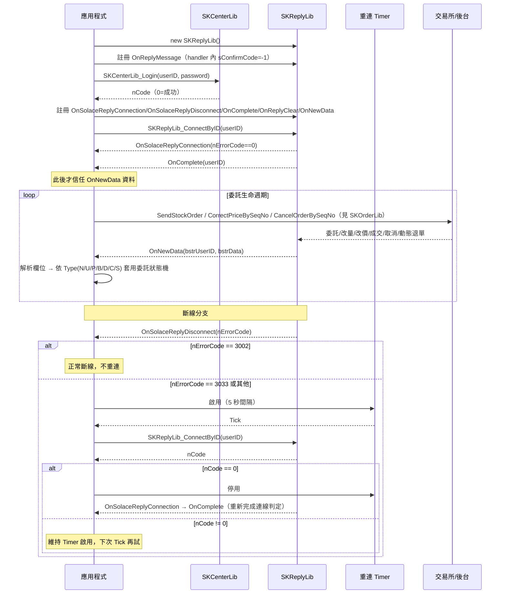

# 流程D：回報處理（OnNewData 解析）

> 來源：`api_spec/modules/SKReplyLib.md`、`api_spec/_raw/12.回報.md`、官方 C# 範例 `Source_code/CapitalAPI_2.13.57_CExample/SKCOMTesterV2/WindowsFormsApp1/{MainForm,ReplyForm}.cs`、`Source_code/CapitalAPI_2.13.57_CExample/SKCOMTester/SKReply.cs`。

## 目標（一句話）

建立 SKReplyLib 回報連線、正確解析 `OnNewData` 逐筆回報字串並套用委託狀態機（委託→改量/改價→成交/刪單/動態退單），且在斷線時依官方規範安全重連，讓程式能即時、正確追蹤每一張委託的生命週期。

## 前置條件（引用 modules/SKReplyLib.md 的節名）

- **`SKReplyLib` 物件建立與 `OnReplyMessage` 註冊必須在 `SKCenterLib_Login` 之前完成**，見 `modules/SKReplyLib.md#初始化與事件註冊：C# 實際寫法` 與 `modules/SKReplyLib.md#OnReplyMessage`；否則登入失敗（錯誤 2017，見 `../error_codes.md`）。
- 已完成 `SKCenterLib_Login` 雙因子登入，見 `modules/SKCenterLib.md#SKCenterLib_Login`。
- 若同時要下單追蹤回報狀態機，需另完成 `SKOrderLib` 初始化流程（`SKOrderLib_Initialize` → `ReadCertByID` → `GetUserAccount`），見 `modules/SKOrderLib.md#初始化與事件註冊`；本流程只涵蓋回報端，下單細節不展開。

## SKReplyLib 事件全覽

| 分類 | 事件 | 是否為現行版本建議使用 | 用途一句話 | 規格出處 |
|---|---|---|---|---|
| 公告 | OnReplyMessage | 是（登入前必註冊） | 公告訊息；handler 內必須回傳 `sConfirmCode = -1` | `modules/SKReplyLib.md#OnReplyMessage` |
| 公告 | OnReplyClearMessage | 是 | 公告開始清除前日資料通知（參數是 UserID） | `modules/SKReplyLib.md#OnReplyClearMessage` |
| 連線 | OnConnect（舊） | 否，改用 OnSolaceReplyConnection | 舊版連線結果通知 | `modules/SKReplyLib.md#OnConnect（舊）` |
| 連線 | OnDisconnect（舊） | 否，改用 OnSolaceReplyDisconnect | 舊版斷線通知 | `modules/SKReplyLib.md#OnDisconnect（舊）` |
| 連線 | OnSolaceReplyConnection | 是 | Solace 回報連線結果（0＝成功） | `modules/SKReplyLib.md#OnSolaceReplyConnection` |
| 連線 | OnSolaceReplyDisconnect | 是 | Solace 回報斷線結果（3002＝正常斷線／3033＝異常需重連） | `modules/SKReplyLib.md#OnSolaceReplyDisconnect` |
| 連線 | OnComplete | 是（連線成功判定的第二個必要條件） | 回報回補完成通知；未收到＝連線/資料異常 | `modules/SKReplyLib.md#OnComplete` |
| 清盤 | OnReplyClear | 是 | 依市場別（R1~R23）通知開始清除前日回報（參數是市場別，非 UserID） | `modules/SKReplyLib.md#OnReplyClear` |
| 回報資料 | **OnNewData** | 是（本流程核心） | 委託/取消/改量/改價/成交/動態退單主動回報（新格式，含預約單） | `modules/SKReplyLib.md#OnNewData` |
| 回報資料 | OnData（舊） | 否，即將下線 | 舊格式回報，欄位同 OnNewData | `modules/SKReplyLib.md#OnData（舊，即將下線）` |
| 智慧單 | OnSmartData（舊） | 否，已淘汰 | 舊版智慧單回報 | `modules/SKReplyLib.md#OnSmartData（舊，已淘汰）` |
| 智慧單 | OnStrategyData | 是 | 新版智慧單（MST/MIOC/MIT/當沖/出清/OCO/AB/CB 等）主動回報 | `modules/SKReplyLib.md#OnStrategyData` |
| 特殊（僅範例） | OnReplyMessageSpecial | 文件未載，範例碼存在 | 訊息中心特殊公告 | `modules/SKReplyLib.md#OnReplyMessageSpecial` |

## 步驟總表

| # | 呼叫 | 所屬 lib | 說明 | 規格出處（modules/xx.md#節名） |
|---|---|---|---|---|
| 1 | `new SKReplyLib()` | SKReplyLib | 建立回報物件（登入前建立） | `modules/SKReplyLib.md#初始化與事件註冊：C# 實際寫法` |
| 2 | 註冊 `OnReplyMessage`（handler 內 `sConfirmCode = -1`） | SKReplyLib | **登入前必要**，否則登入失敗 | `modules/SKReplyLib.md#OnReplyMessage` |
| 3 | `SKCenterLib_Login(userID, password)` | SKCenterLib | 雙因子登入 | `modules/SKCenterLib.md#SKCenterLib_Login` |
| 4 | 註冊回報事件（`OnSolaceReplyConnection`/`OnSolaceReplyDisconnect`/`OnComplete`/`OnReplyClear`/`OnNewData`/`OnReplyClearMessage`/`OnStrategyData`） | SKReplyLib | 連線前註冊一次即可，重複掛載會重複觸發 | `modules/SKReplyLib.md#初始化與事件註冊：C# 實際寫法` |
| 5 | `SKReplyLib_ConnectByID(userID)` | SKReplyLib | 建立回報主機（Solace）連線並觸發回補 | `modules/SKReplyLib.md#SKReplyLib_ConnectByID` |
| 6 | 等待 `OnSolaceReplyConnection`（`nErrorCode==0`） | SKReplyLib | 連線成功通知；**尚未代表回補完成** | `modules/SKReplyLib.md#OnSolaceReplyConnection` |
| 7 | 等待 `OnComplete` | SKReplyLib | 回補完成，此後 `OnNewData` 資料才可信 | `modules/SKReplyLib.md#OnComplete` |
| 8 | `OnNewData(bstrUserID, bstrData)` 逐筆解析並套用狀態機 | SKReplyLib | 委託/取消/改量/改價/成交/動態退單 | `modules/SKReplyLib.md#OnNewData` |
| 9 | （選用）`OnStrategyData(bstrUserID, bstrData)` | SKReplyLib | 智慧單狀態回報，欄位佈局依市場/單別而異 | `modules/SKReplyLib.md#OnStrategyData` |
| 10 | 斷線：`OnSolaceReplyDisconnect(nErrorCode)` | SKReplyLib | 3002＝正常斷線；3033／其他＝異常，需重連 | `modules/SKReplyLib.md#OnSolaceReplyDisconnect` |
| 11 | Timer 延遲數秒後重呼 `SKReplyLib_ConnectByID` | SKReplyLib | **勿在斷線事件內立即重連**；官方範例用 5 秒 Timer | `modules/SKReplyLib.md#陷阱與注意`（第 3、4 條） |

## OnNewData 逐欄位解析表（含「證逐筆 vs BuySell」標籤疑義）

`bstrData` 以「,」分隔；解析前先判斷 `values[0]=="980"`（後台問題訊息，非標準格式，直接記錄原始字串即可）。官方範例僅解析前 48 欄（index 0-47），第 49 欄（index 48, `OFSTPFlag`）為 V2.13.40 新增，範例未處理，**解析程式需用「至少 N 欄」而非「恰好 N 欄」的防禦式寫法**。完整欄位定義以 `modules/SKReplyLib.md#OnNewData` 為準，下表節錄並補充狀態機/解析用途：

| # | 欄位 | 用途摘要 | 本流程解析備註 |
|---|---|---|---|
| 0 | KeyNo | 原始 13 碼委託序號 | **狀態機主鍵**：同一張委託的 N→U/P/B→D/C/S 生命週期都以此欄追蹤 |
| 1 | MarketType | TS/TA/TL/TP/TC/TF/TO/OF/OO/OS | 決定要核對哪個下單/刪改單函式家族（見 `modules/SKOrderLib.md`） |
| 2 | Type | N委託／C取消／U改量／P改價／D成交／B改價改量／S動態退單 | **狀態機事件代碼**，見下節「委託狀態機」 |
| 3 | OrderErr | Y失敗／T逾時／N正常 | **先判斷這欄**：Y/T 時本筆委託失敗/逾時，不套用狀態機，只記錄 ErrorMsg |
| 4 | Broker | 分公司代號 / IB 代號 | — |
| 5 | CustNo | 交易帳號 | 建議與 KeyNo 組成複合鍵，避免跨帳號序號碰撞 |
| 6 | BuySell | 買賣別 | **官方標籤疑義**：見下方說明框 |
| 7 | ExchangeID | 交易所 | — |
| 8 | ComId | 商品代碼 | — |
| 9 | StrikePrice | 履約價（**保留欄位**） | V2.13.45 起停用，改讀 34/37（StrikePrice1/2） |
| 10 | OrderNo | 委託書號（5 碼） | 可對應 `CorrectPriceByBookNo`/`CancelOrderByBookNo` 的書號參數 |
| 11 | Price | 委託價或成交價 | 同一欄位隨 Type 變義：N＝委託價，D＝成交價 |
| 12–19 | Numerator/Denominator/Price1/Numerator1/Denominator1/Price2/Numerator2/Denominator2 | 海期價格帶（分子/分母）、期選第二腳成交價 | 海期需另行組合成小數；國內市場多半為空字串 |
| 20 | Qty | 股數/口數 | N＝委託量；D＝**本次**成交量（可分批） |
| 21 | BeforeQty | 異動前量 | 僅證券、複委託市場提供；Type=U/B 時有效 |
| 22 | AfterQty | 異動後量 | 同上 |
| 23–24 | Date/Time | 交易日期/時間 | — |
| 25 | OkSeq | 成交序號（舊） | **勿用**，成交序號請以 38（ExecutionNo）為主 |
| 26–29 | SubID/SaleNo/Agent/TradeDate | 子帳帳號/營業員編號/委託介面/委託日期 | — |
| 30 | MsgNo | 回報流水號 | 可用於去重（同一 MsgNo 只套用狀態機一次，避免斷線重送造成重複計量） |
| 31 | PreOrder | A盤中單／B預約單 | — |
| 32–37 | ComId1/YearMonth1/StrikePrice1/ComId2/YearMonth2/StrikePrice2 | 期選兩腳商品資訊 | 履約價請用這兩組取代 index 9 |
| 38 | ExecutionNo | 成交序號 | **請以此欄為主**，取代舊欄位 OkSeq |
| 39 | PriceSymbol | 下單期標 | — |
| 40 | Reserved | 盤別（A:T盤 B:T+1盤） | — |
| 41 | OrderEffective | 有效委託日 | — |
| 42 | CallPut | C:Call／P:Put | — |
| 43 | OrderSeq | 上手單號 | — |
| 44 | ErrorMsg | 委託單錯誤訊息 | 內含逗號已於 V2.13.39 起被替換為空白，可安全用「,」切欄不會誤切 |
| 45 | CancelOrderMarkByExchange | E:交易所動態退單 | Type=S（動態退單）時的關鍵欄位 |
| 46 | ExchangeTandemMsg | 交易所/後台退單訊息 | `[00]`交易所回應／`[000]`交易後台／`[D]`委託成功後交易所主動退單 |
| 47 | SeqNo | 13 碼序號（IOC/FOK 產生取消單比對用） | V2.13.38 新增；官方範例解析到此為止（陣列宣告 48 個元素，index 0-47） |
| 48 | OFSTPFlag | 海期停損限價/停損市價已觸發註記（Y） | V2.13.40 新增；**官方範例未解析**，需自行以 `values.Length > 48` 判斷後讀取 |

> **官方標籤疑義（index 6，BuySell）**：`_raw/12.回報.md` 中 `dataGridViewNoClass.Columns.Add("Column7", ...)` 的欄位標籤文字是「證逐筆」（`_raw/12.回報.md:231`），語意不明、也非任何已知欄位名稱；但同一段官方 C# 範例把對應變數宣告並賦值為 `BuySell`（`Source_code/.../ReplyForm.cs:1439,1502`；`_raw/12.回報.md:235` 的程式碼片段亦同），且 `OnStrategyData` 中對稱位置的欄位在文件裡明確標為「買賣別」／`BuySell2`（`_raw/12.回報.md:359,470,508`）。**結論：以程式變數名 `BuySell`（買賣別：買/賣方向）為準，「證逐筆」應是 docx 轉檔或人工填表時的標籤誤植，不是這個欄位的真實語意**，AI 生成程式碼時請勿依字面「證逐筆」去解析或建欄位名。

## 委託狀態機

處理順序：① 先判斷 `values[0]=="980"`（後台問題訊息，非標準格式）→ ② 判斷 `OrderErr`（Y/T 直接記錄失敗、不進入狀態機）→ ③ 依 `Type` 分派狀態轉移。狀態機建議以 `KeyNo`（必要時加 `CustNo`）為主鍵；`MsgNo` 可用於去重，避免斷線重送造成重複套用。

| Type | 意義 | 觸發來源（呼叫） | 關鍵欄位 | 可能的下一狀態 |
|---|---|---|---|---|
| N | 新委託／委託成功掛單 | `SendStockOrder` / `SendFutureOrder` / `SendOptionOrder` 等（`modules/SKOrderLib.md#SendStockOrder` 等） | KeyNo, OrderNo, Price, Qty | U／P／B／D／C／S |
| U | 改量 | `DecreaseOrderBySeqNo`（`modules/SKOrderLib.md#DecreaseOrderBySeqNo`） | BeforeQty → AfterQty | 可再收到 U／P／B／D／C／S |
| P | 改價 | `CorrectPriceBySeqNo` / `CorrectPriceByBookNo`（`modules/SKOrderLib.md#CorrectPriceBySeqNo`） | Price（新價） | 同上 |
| B | 改價改量 | 部分市場合併回報改價與改量 | Price + BeforeQty/AfterQty | 同上 |
| D | 成交（可分批） | 被動：交易所撮合成功 | Price（成交價）, Qty（本次成交量）, ExecutionNo | 未全部成交前仍可能再收到 D，或針對剩餘量收到 C |
| C | 取消／刪單 | `CancelOrderBySeqNo` / `CancelOrderByBookNo` / `CancelOrderByStockNo(Advance)`（`modules/SKOrderLib.md#CancelOrderBySeqNo` 等） | — | 終態 |
| S | 動態退單 | 被動：交易所依即時價格區間主動退單 | CancelOrderMarkByExchange, ExchangeTandemMsg | 同時仍會收到委託回報與取消回報（C）；若已有成交部位，另會收到成交回報（D） |

備註：
- 各下單/刪改函式（`SendStockOrder`、`CorrectPriceBySeqNo`、`CancelOrderBySeqNo` 等）回傳 0 只代表「委託伺服器接收成功」，**不代表委託真的成立/改價/刪單成功**——實際結果一律以 `OnNewData` 回報為準（見各函式備註，`modules/SKOrderLib.md`）。
- 非同步下單（`bAsyncOrder=true`）額外由 `OnAsyncOrder` 通知送單結果（`modules/SKOrderLib.md#OnAsyncOrder`），但委託後續狀態轉移仍一律由本流程的 `OnNewData` 驅動。
- 動態退單成因：買進委託成交價 > 即時價格區間上限，或賣出委託成交價 < 區間下限；區間上/下限＝退單價 ± 退單點數（見 `modules/SKReplyLib.md#OnNewData` 備註）。

## 最小可運作 C# 骨架

```csharp
using System;
using System.Collections.Generic;
using System.Windows.Forms;
using SKCOMLib; // Interop.SKCOMLib

namespace ReplyDemo
{
    // 1) 物件宣告 + 登入前註冊公告 —— 來源：MainForm.cs:19-20, 184-200
    public partial class MainForm : Form
    {
        SKCenterLib m_pSKCenter = new SKCenterLib(); // 登入&環境設定物件
        SKReplyLib  m_pSKReply  = new SKReplyLib();  // 回報物件

        private void MainForm_Load(object sender, EventArgs e)
        {
            // 註冊公告(必要) —— 必須在 SKCenterLib_Login 之前
            m_pSKReply.OnReplyMessage += new _ISKReplyLibEvents_OnReplyMessageEventHandler(OnAnnouncement);
            void OnAnnouncement(string strUserID, string bstrMessage, out short nConfirmCode)
            {
                nConfirmCode = -1; // 未回傳 -1 將無法正確登入（錯誤 2017，見 ../error_codes.md）
            }
        }

        // 2) 登入 —— 來源：MainForm.cs:875-908（節錄，省略 UI 訊息輸出）
        private void Login(string userID, string password)
        {
            int nCode = m_pSKCenter.SKCenterLib_Login(userID, password);
            if (nCode != 0)
            {
                // 非 0：查 ../error_codes.md；常見如密碼錯誤、憑證未安裝/過期
                return;
            }
            // 登入成功後才可進行回報事件註冊與連線（步驟 4、5）
            new ReplyHandler().RegisterAndConnect(m_pSKReply, m_pSKCenter, userID);
        }
    }

    // 3) 回報事件註冊、連線、斷線重連、OnNewData 解析與狀態機套用 —— 本流程核心
    public class ReplyHandler
    {
        SKReplyLib m_pSKReply;
        SKCenterLib m_pSKCenter;
        string m_userID;
        readonly OrderStateStore m_store = new OrderStateStore(); // 本骨架新增：委託狀態機（非官方範例，對應上方「委託狀態機」表）
        readonly Timer m_timerSolaceReconnect = new Timer { Interval = 5000 }; // 官方範例：5 秒重連一次（ReplyForm.cs:1625,1804-1823）

        public void RegisterAndConnect(SKReplyLib pSKReply, SKCenterLib pSKCenter, string userID)
        {
            m_pSKReply = pSKReply; m_pSKCenter = pSKCenter; m_userID = userID;

            // 回報相關事件掛載（連線前註冊一次即可）—— 來源：SKReply.cs:279-290
            m_pSKReply.OnSolaceReplyConnection += new _ISKReplyLibEvents_OnSolaceReplyConnectionEventHandler(OnSolaceReplyConnection);
            m_pSKReply.OnSolaceReplyDisconnect += new _ISKReplyLibEvents_OnSolaceReplyDisconnectEventHandler(OnSolaceReplyDisconnect);
            m_pSKReply.OnComplete              += new _ISKReplyLibEvents_OnCompleteEventHandler(OnComplete);
            m_pSKReply.OnReplyClear            += new _ISKReplyLibEvents_OnReplyClearEventHandler(OnReplyClear);
            m_pSKReply.OnNewData                += new _ISKReplyLibEvents_OnNewDataEventHandler(OnNewData);

            m_timerSolaceReconnect.Tick += TimerSolaceReconnect_Tick;

            // 指定回報連線的使用者登入帳號 —— 來源：ReplyForm.cs:1923
            int nCode = m_pSKReply.SKReplyLib_ConnectByID(userID);
            if (nCode != 0)
                Console.WriteLine("【SKReplyLib_ConnectByID】" + m_pSKCenter.SKCenterLib_GetReturnCodeMessage(nCode));
        }

        // 連線結果通知 —— 來源：ReplyForm.cs:1639-1652
        void OnSolaceReplyConnection(string bstrUserID, int nErrorCode)
        {
            // 收到此事件時底層尚未完成處理，勿在此立即重連/斷線（modules/SKReplyLib.md 陷阱#3）
            Console.WriteLine(nErrorCode == 0 ? "連線成功，等待 OnComplete 回補完成" : "連線失敗:" + nErrorCode);
        }

        // 回補完成通知 —— 來源：ReplyForm.cs:1566-1576
        void OnComplete(string bstrUserID)
        {
            Console.WriteLine("【OnComplete】" + bstrUserID + " 回報連線&資料正常，開始信任 OnNewData");
        }

        // 清盤通知 —— 來源：ReplyForm.cs:1579-1596（參數是市場別 R1~R23，不是 UserID）
        void OnReplyClear(string bstrMarket)
        {
            Console.WriteLine("【OnReplyClear】" + bstrMarket + " 正在清除前日回報");
        }

        // 斷線通知 —— 來源：ReplyForm.cs:1612-1636
        void OnSolaceReplyDisconnect(string bstrUserID, int nErrorCode)
        {
            if (nErrorCode == 3002)
            {
                Console.WriteLine("【OnSolaceReplyDisconnect】斷線成功（正常）");
            }
            else if (nErrorCode == 3033) // SK_SUBJECT_SOLACE_SESSION_EVENT_ERROR，主機端主動斷線
            {
                Console.WriteLine("【OnSolaceReplyDisconnect】連線異常，啟動重連 Timer");
                m_timerSolaceReconnect.Start(); // 勿在此立即重連，交給 Timer（陷阱#3）
            }
            else
            {
                Console.WriteLine("【OnSolaceReplyDisconnect】未預期的斷線:" + nErrorCode);
                m_timerSolaceReconnect.Start(); // 比照異常處理，5 秒後重試
            }
        }

        // 斷線重連 Timer —— 來源：ReplyForm.cs:1804-1823
        void TimerSolaceReconnect_Tick(object sender, EventArgs e)
        {
            int nCode = m_pSKReply.SKReplyLib_ConnectByID(m_userID); // ReplyForm.cs:1807
            Console.WriteLine("【自動重連中...】" + m_pSKCenter.SKCenterLib_GetReturnCodeMessage(nCode));
            if (nCode == 0) // 連線成功 —— ReplyForm.cs:1810,1821
            {
                m_timerSolaceReconnect.Stop();
            }
        }

        // OnNewData 解析 + 委託狀態機套用 —— 欄位擷取來源：ReplyForm.cs:1430-1547
        // （官方範例接著用 10 段 dataGridViewXX.Rows.Add(...) 把資料丟進畫面表格，
        //   ReplyForm.cs:1549-1558，此處以狀態機取代該段 UI 陳列邏輯）
        void OnNewData(string bstrLogInID, string bstrData)
        {
            string[] v = bstrData.Split(',');
            if (v[0] == "980") // 980：後台問題訊息，非標準欄位格式
            {
                Console.WriteLine("【OnNewData:980】" + bstrData);
                return;
            }

            // 逐欄位還原（完整 49 欄定義見上表「OnNewData 逐欄位解析表」）
            string keyNo      = v[0];
            string marketType = v[1];
            string type       = v[2];
            string orderErr   = v[3];
            string buySell    = v[6];  // 官方變數名 BuySell（買賣別）；見「證逐筆 vs BuySell」標籤疑義
            string orderNo    = v[10];
            string price      = v[11];
            string qty        = v[20];
            string beforeQty  = v[21];
            string afterQty   = v[22];
            string executionNo = v.Length > 38 ? v[38] : ""; // 成交序號以此為主，非 OkSeq(v[25])
            string errorMsg     = v.Length > 44 ? v[44] : "";

            if (orderErr == "Y" || orderErr == "T")
            {
                m_store.Reject(keyNo, errorMsg); // 委託本身失敗/逾時，不套用狀態機
                return;
            }

            // 依 Type 分派狀態轉移（本骨架新增，對應上方「委託狀態機」表）
            switch (type)
            {
                case "N": m_store.Accept(keyNo, marketType, buySell, orderNo, price, qty); break;
                case "U": m_store.ChangeQty(keyNo, beforeQty, afterQty); break;
                case "P": m_store.ChangePrice(keyNo, price); break;
                case "B": m_store.ChangePriceQty(keyNo, price, afterQty); break;
                case "D": m_store.Fill(keyNo, price, qty, executionNo); break;
                case "C": m_store.Cancel(keyNo); break;
                case "S": m_store.ExchangeReject(keyNo, errorMsg); break;
            }
        }
    }

    // 委託狀態機（本檔新增，非官方範例；依 modules/SKReplyLib.md#OnNewData 的 Type 欄位實作）
    public class OrderStateStore
    {
        public enum OrderState { Accepted, Modified, Filled, Cancelled, ExchangeRejected, Rejected }

        public class Record
        {
            public OrderState State;
            public string Price;
            public string Qty;
            public string ExecutionNo;
        }

        readonly Dictionary<string, Record> _byKeyNo = new Dictionary<string, Record>();

        public void Accept(string keyNo, string market, string buySell, string orderNo, string price, string qty)
            => _byKeyNo[keyNo] = new Record { State = OrderState.Accepted, Price = price, Qty = qty };

        public void ChangeQty(string keyNo, string beforeQty, string afterQty)
        {
            if (_byKeyNo.TryGetValue(keyNo, out var r)) { r.Qty = afterQty; r.State = OrderState.Modified; }
        }

        public void ChangePrice(string keyNo, string price)
        {
            if (_byKeyNo.TryGetValue(keyNo, out var r)) { r.Price = price; r.State = OrderState.Modified; }
        }

        public void ChangePriceQty(string keyNo, string price, string afterQty)
        {
            if (_byKeyNo.TryGetValue(keyNo, out var r)) { r.Price = price; r.Qty = afterQty; r.State = OrderState.Modified; }
        }

        public void Fill(string keyNo, string price, string qty, string executionNo)
        {
            if (_byKeyNo.TryGetValue(keyNo, out var r)) { r.State = OrderState.Filled; r.ExecutionNo = executionNo; }
        }

        public void Cancel(string keyNo)
        {
            if (_byKeyNo.TryGetValue(keyNo, out var r)) r.State = OrderState.Cancelled;
        }

        public void ExchangeReject(string keyNo, string errorMsg)
        {
            if (_byKeyNo.TryGetValue(keyNo, out var r)) r.State = OrderState.ExchangeRejected;
        }

        public void Reject(string keyNo, string errorMsg)
        {
            // OrderErr=Y/T：委託本身失敗/逾時，不建立/更新狀態機紀錄，僅記錄失敗訊息即可
        }
    }
}
```

## 斷線重連

1. 斷線通知一律來自 `OnSolaceReplyDisconnect(bstrUserID, nErrorCode)`（`modules/SKReplyLib.md#OnSolaceReplyDisconnect`）。**`nErrorCode==3002` 是「斷線成功」的正常結果**（例如程式主動呼叫 `SKReplyLib_SolaceCloseByID`），不需重連；`nErrorCode==3033`（`SK_SUBJECT_SOLACE_SESSION_EVENT_ERROR`，主機端主動斷線）或其他未預期值才需要重連。
2. **勿在 `OnSolaceReplyDisconnect` 事件內立即呼叫 `SKReplyLib_ConnectByID`**——官方文件明載此時底層尚未完成處理；正確做法是啟用一個 Timer，官方範例採 5 秒間隔（`ReplyForm.cs:1625` 啟用 `timerSolaceReconnect`）。
3. Timer 到時觸發 `SKReplyLib_ConnectByID(userID)` 重連（`ReplyForm.cs:1804-1823`）；若回傳 0（成功）才停用 Timer，否則維持啟用、下次 Tick 再試一次。
4. 重連成功後仍需重新走「等待 `OnSolaceReplyConnection`（0）→ 等待 `OnComplete`」的完整判定，才能信任後續 `OnNewData`；回報事件（`OnNewData`/`OnComplete`/... ）只需註冊一次，重連不必重新掛載。
5. `SKReplyLib_IsConnectedByID` 可用於主動查詢目前連線狀態，但**回傳值不是錯誤碼**（0＝斷線、1＝連線中、2＝下載中），勿以「0＝成功」慣例誤判（`modules/SKReplyLib.md#SKReplyLib_IsConnectedByID`）。

## Mermaid sequenceDiagram



## 常見錯誤與檢查點

| # | 錯誤/誤用 | 後果 | 檢查點 |
|---|---|---|---|
| 1 | `SKReplyLib` 建立/`OnReplyMessage` 註冊晚於 `SKCenterLib_Login`，或 handler 未回傳 `sConfirmCode=-1` | 登入失敗（錯誤 2017，見 [../error_codes.md](../error_codes.md)） | 確認物件建立與事件註冊順序，`modules/SKReplyLib.md#陷阱與注意` 第 1 條 |
| 2 | 只等 `OnSolaceReplyConnection` 就開始信任回報 | 回報資料可能不完整（回補未完成） | 必須再等 `OnComplete` 才開始處理 `OnNewData`，`modules/SKReplyLib.md#OnComplete` |
| 3 | 在 `OnSolaceReplyConnection`/`OnSolaceReplyDisconnect` 事件內立即呼叫 `ConnectByID`/`SolaceCloseByID` | 底層尚未處理完成，行為未定義 | 一律改用 Timer 延遲數秒後再操作，見「斷線重連」 |
| 4 | 把 `OnSolaceReplyDisconnect` 的 `nErrorCode==3002` 當成錯誤處理 | 誤觸發不必要的重連邏輯 | 3002＝正常斷線；3033／其他才需重連 |
| 5 | 用「恰好 N 欄」解析 `bstrData`（如 `values.Length == 48`才處理） | 版本升級新增欄位（V2.13.38 加 SeqNo、V2.13.40 加 OFSTPFlag）造成解析失敗或崩潰 | 一律用「至少 N 欄」防禦式寫法（`values.Length > N` 才讀取該索引） |
| 6 | 履約價讀 index 9（`StrikePrice`）而非 34/37 | V2.13.45 起 index 9 為保留欄位，讀到舊值或空值 | 履約價一律讀 `StrikePrice1`(34)/`StrikePrice2`(37) |
| 7 | 成交序號讀 `OkSeq`(25) 而非 `ExecutionNo`(38) | 與其他回報/查詢 API 的成交序號對不上 | 一律以 `ExecutionNo` 為主 |
| 8 | 把 `SKReplyLib_IsConnectedByID` 回傳值當一般錯誤碼判斷（0＝成功慣例） | 誤判連線狀態 | 此函式 0＝斷線、1＝連線中、2＝下載中，其他值才是錯誤碼（[../error_codes.md](../error_codes.md)） |
| 9 | 把 `OnReplyClear` 的參數當 UserID 處理 | 市場別字串（R1~R23）誤當帳號使用 | `OnReplyClear` 參數是市場別；UserID 是 `OnReplyClearMessage` 的參數 |
| 10 | 依 docx 欄位標籤字面「證逐筆」解析 index 6 | 誤解欄位語意或建錯欄位名稱 | 該欄位程式變數名為 `BuySell`（買賣別），見上方「官方標籤疑義」說明 |
| 11 | 認為 `SendStockOrder`/`CorrectPriceBySeqNo`/`CancelOrderBySeqNo` 等回傳 0 就代表委託/改價/刪單已經成立 | 狀態機提前判定成功，實際可能被後台或交易所拒絕 | 回傳 0 只代表「委託伺服器接收成功」，實際結果一律等 `OnNewData` 回報；非 0 查 [../error_codes.md](../error_codes.md) |
| 12 | 沒有用 `MsgNo` 去重就重複套用狀態機 | 斷線重連後重送回報，造成成交量重複累加等錯誤 | 同一 `MsgNo` 只處理一次（可用簡單的已處理集合或以 KeyNo+MsgNo 做冪等鍵） |
